## Overview


This is the attack and detection log for the lab built in Part 1: [<u>Purple Team SOC Lab — Environment Build</u>](/socdocs/purple-team-lab-build/). Fourteen attacks, eight against the Active Directory domain (`lab.local`) and six against an OWASP Juice Shop instance, each run from Kali and each paired with a Splunk detection I wrote and tuned against the live telemetry it produced.

The goal wasn't just to get an attack to succeed. It was to see exactly what it looked like in the logs, figure out what a real detection needs to key on, and find out where the default configuration and default logging assumptions fall short. Several of these did not detect cleanly on the first attempt, and the tuning process is documented as part of the writeup rather than cleaned up after the fact.

Before any of this, Advanced Audit Policy on DC01 was confirmed to actually be logging Kerberos ticket requests (4768/4769) and detailed logon failures (4625) — the default GPO in a fresh AD install often doesn't log these at the level of detail needed, and it's worth checking before assuming a blank search result means "no attack" instead of "no logging."

---

## Section A: Active Directory


Attacks 1–8 target DC01 (10.10.10.10) and CLIENT02, from Kali at 10.10.10.104.

### Attack 1: Network / service discovery

**Scenario:** Full TCP port scan against DC01 and CLIENT02, representing the reconnaissance phase an attacker runs against any newly-accessed segment before deciding what to target.

**Attack:**

```
nmap -sV -p- 10.10.10.10 10.10.10.101
```

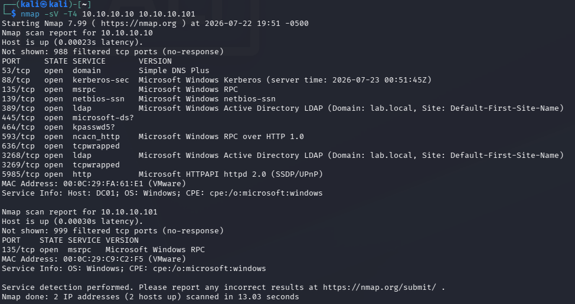

**Detection:** Sysmon Event ID 3 (Network Connection), filtered to the attacker's source IP and counting distinct destination ports:

```
index=main sourcetype="XmlWinEventLog:Microsoft-Windows-Sysmon/Operational" EventCode=3 src_ip=10.10.10.104
| stats dc(dest_port) as unique_ports by src_ip, dest_ip
| where unique_ports > 20
```

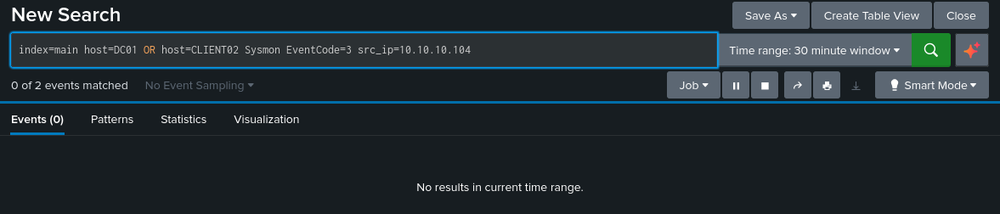

**MITRE ATT&CK:** T1046 — Discovery (Network Service Discovery)

**Analyst notes:** This one didn't detect. The scan generated ~65,500 filtered probes and no completed connections, so there was nothing for Sysmon Event ID 3 to log in the first place — it only fires on established connections. The ~18 ports that were open belong to core AD services (Kerberos, LDAP, SMB, DNS), and the SwiftOnSecurity Sysmon config explicitly excludes those ports from Event ID 3 to cut noise, so even the legitimate hits weren't logged. Host-based telemetry is structurally blind to this attack. Detecting a port scan requires visibility into the raw traffic itself — Zeek or Suricata sitting on the wire — not endpoint logging. Documenting this as a gap rather than trying to force a host-based detection to work is the more honest outcome, and a good argument for defense-in-depth: host and network telemetry catch different things.

---

### Attack 2: Kerberoasting

**Scenario:** Requested a Kerberos service ticket for `svc-sql`, a seeded service account with an SPN and a weak password, representing the most common path from a low-privilege domain foothold to a crackable credential.

**Attack:** Authenticated as a normal low-privilege user (`anguyen`) and requested a TGS for the `svc-sql` SPN with Impacket:

```
GetUserSPNs.py lab.local/anguyen:<password> -dc-ip 10.10.10.10 -request
```

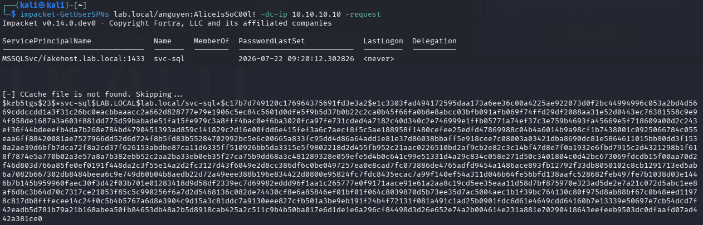

The ticket is encrypted with the service account's NTLM hash, so it's crackable offline without touching the DC again. Planned to run it through `hashcat -m 13100`, but VMware wasn't passing the GPU through to Kali cleanly, so I cracked it with John the Ripper instead.

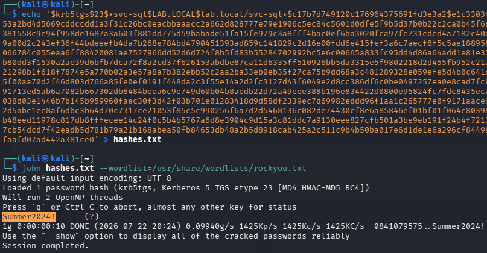

**Detection:** Event ID 4769 (Kerberos Service Ticket Operations), filtering for RC4 encryption (`0x17`) on a non-machine account — that specific combination is what separates Kerberoasting from routine service ticket issuance:

```
index=main EventCode=4769 Ticket_Encryption_Type=0x17 Account_Name!="*$"
| eval encryption_type=case(Ticket_Encryption_Type="0x17", "RC4 (weak)", 1=1, Ticket_Encryption_Type)
| stats count as ticket_requests, values(Service_Name) as targeted_accounts, latest(_time) as last_seen by Account_Name, Client_Address, encryption_type
| where ticket_requests >= 1
| convert ctime(last_seen)
```

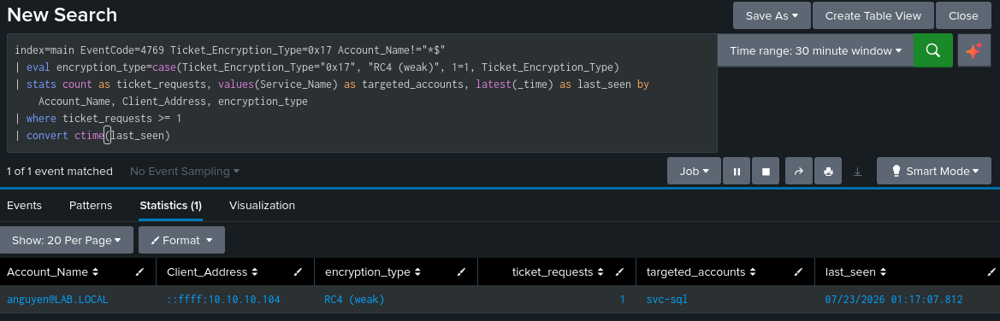
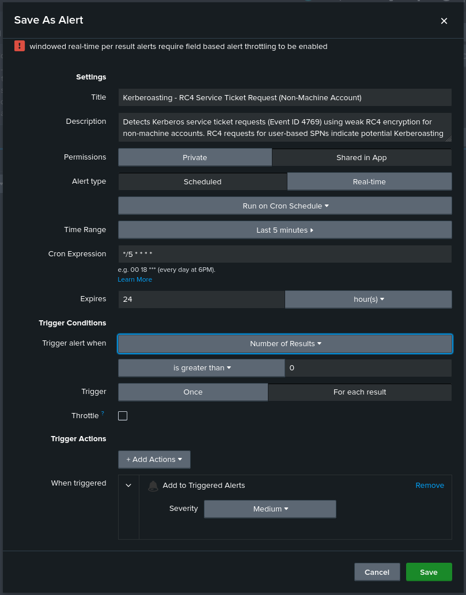

**MITRE ATT&CK:** T1558.003 — Credential Access (Steal or Forge Kerberos Tickets: Kerberoasting)

**Analyst notes:** First pass at this detection used `ticket_requests > 3`, on the assumption that a real attack would generate a burst of requests. It didn't — a single roasting attempt against one SPN produces exactly one Event ID 4769, and the threshold silently ate the only event that mattered. That's a false negative baked directly into the query. Dropped the threshold to `>= 1`, since the real signal isn't volume, it's the RC4-plus-non-machine-account combination itself: there's no legitimate reason a standard user account should be issued an RC4 service ticket, regardless of how many times it happens. A count-based threshold makes sense for brute-force-style attacks; it's the wrong instinct for a technique where one occurrence is already conclusive. Good reminder to validate thresholds against what the attack actually produces rather than what seems intuitively "suspicious enough."

---

### Attack 3: AS-REP Roasting

**Scenario:** Requested authentication data for `jsmith-legacy`, a seeded account with Kerberos pre-authentication disabled, representing a legacy-app compatibility setting that most orgs still have sitting somewhere in AD.

**Attack:** Impacket against a username list built from SecLists' `top-usernames-shortlist` plus the domain's actual users, no credentials required:

```
impacket-GetNPUsers lab.local/ -usersfile users.txt -dc-ip 10.10.10.10 -no-pass
```

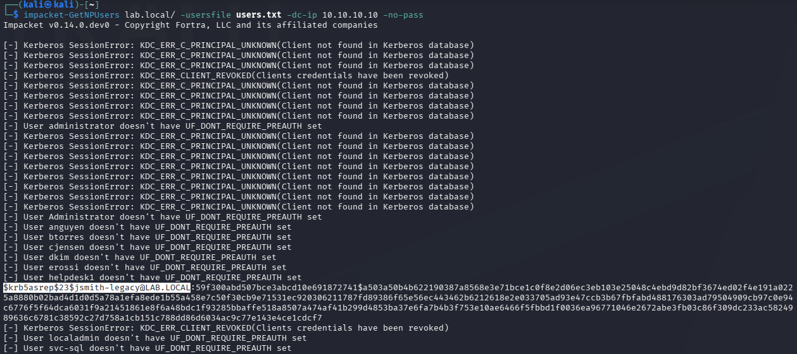

**Detection:** Event ID 4768 (Kerberos Authentication Service) where `Pre_Authentication_Type` is `0`:

```
index=main EventCode=4768 Pre_Authentication_Type=0
| eval risk=case(Account_Name="jsmith-legacy", "Known-weak account", 1=1, "Unexpected AS-REP roastable account")
| stats count as auth_requests, latest(_time) as last_seen by Account_Name, Client_Address, risk
| convert ctime(last_seen)
```

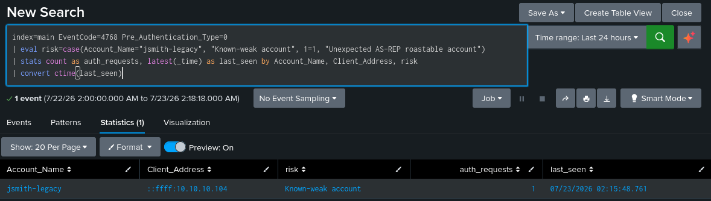

**MITRE ATT&CK:** T1558.004 — Credential Access (Steal or Forge Kerberos Tickets: AS-REP Roasting)

**Analyst notes:** The interesting part of this attack isn't the detection, it's the prerequisite. Kerberoasting needs a valid authenticated session before you can request anything. AS-REP Roasting needs nothing — pre-auth is disabled specifically so the DC will hand back encrypted authentication data to anyone who asks, credentialed or not. That means this technique is viable from the earliest possible stage of an intrusion, before an attacker has any foothold at all. It's the reason the detection logic doesn't bother with a threshold the way the Kerberoasting one initially did: a single hit against this account, or any account with this flag set, is high severity on its own, full stop.

---

### Attack 4: Password spraying

**Scenario:** Sprayed a single weak password across every seeded account via SMB, representing the standard technique attackers use to avoid the account lockout thresholds that a traditional brute-force would trip.

**Attack:**

```
nxc smb 10.10.10.10 -u users.txt -p Summer2026! --continue-on-success
```

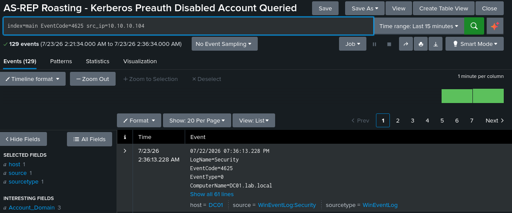

**Detection:** netexec authenticates over SMB/NTLM rather than Kerberos, so it generates Event IDs 4625 (logon failure) and 4776 (NTLM credential validation) — not 4771. The query buckets into 5-minute windows and counts distinct accounts targeted from one source, which is the actual signature of a spray:

```
index=main (EventCode=4625 OR EventCode=4776) src_ip=10.10.10.104
| eval auth_type=case(EventCode=4776, "NTLM (4776)", EventCode=4625, "Network Logon Failure (4625)")
| bucket _time span=5m
| stats dc(Account_Name) as unique_accounts, values(auth_type) as event_types by _time, src_ip
| where unique_accounts > 3
```

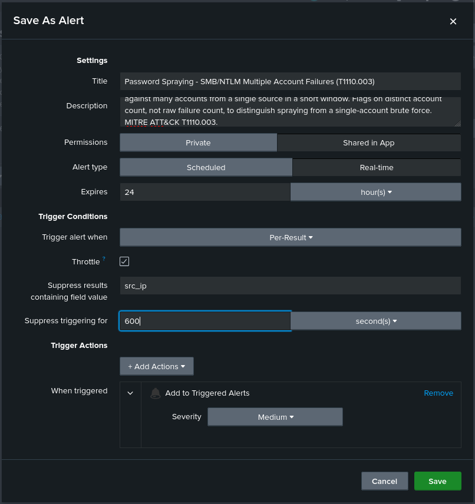

**MITRE ATT&CK:** T1110.003 — Credential Access (Brute Force: Password Spraying)

**Analyst notes:** Wrote the first version of this query expecting to key on Event ID 4771 (Kerberos pre-auth failure), since that's the classic spraying indicator in most AD detection writeups. It never fired — netexec's SMB auth path doesn't touch Kerberos pre-auth at all, it goes straight through NTLM, which shows up as 4625/4776 instead. The bigger structural point is `dc(Account_Name)` instead of raw failure count. A brute-force is one account, many passwords. A spray is many accounts, one password. Counting total failures doesn't distinguish the two; counting distinct accounts targeted from a single source in a tight window does. That distinction is the actual detection, not the event IDs themselves.

---

### Attack 5: Lateral movement (reused local admin password)

**Scenario:** Moved from CLIENT02 to DC01 using the local `localadmin` account, whose password was deliberately reused across both hosts — representing one of the most common real-world lateral movement paths in flat or poorly segmented environments.

**Attack:**

```
psexec.py localadmin:Passw0rd123!@10.10.10.10
```

Windows Defender killed `psexec.py` on the first two attempts, and both `wmiexec.py` and `smbexec.py` failed the same way. Only got a shell after disabling the Windows Firewall on DC01 — which turned out to be its own detectable event.

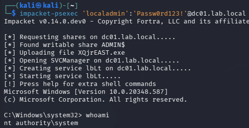

**Detection:** Event ID 7045 (service creation) is the strongest signature for psexec-style lateral movement — it fires when the technique drops and starts a service binary to get code execution. The randomized short service name and system-directory binary path are the tell:

```
index=main EventCode=7045
| eval random_svc_name=if(match(Service_Name, "^[A-Za-z]{4}$"), 1, 0)
| eval random_exe=if(match(Service_File_Name, "(?i)%systemroot%\\[A-Za-z]{8}\.exe"), 1, 0)
| eval smbexec_pattern=if(match(Service_File_Name, "(?i)%COMSPEC%.*echo.*\.bat"), 1, 0)
| where random_svc_name=1 OR random_exe=1 OR smbexec_pattern=1
| eval technique=case(smbexec_pattern=1, "smbexec (batch/cmd)", random_exe=1, "psexec (service binary)", 1=1, "Suspicious service")
| table _time, host, Service_Name, Service_File_Name, technique
| sort -_time
```

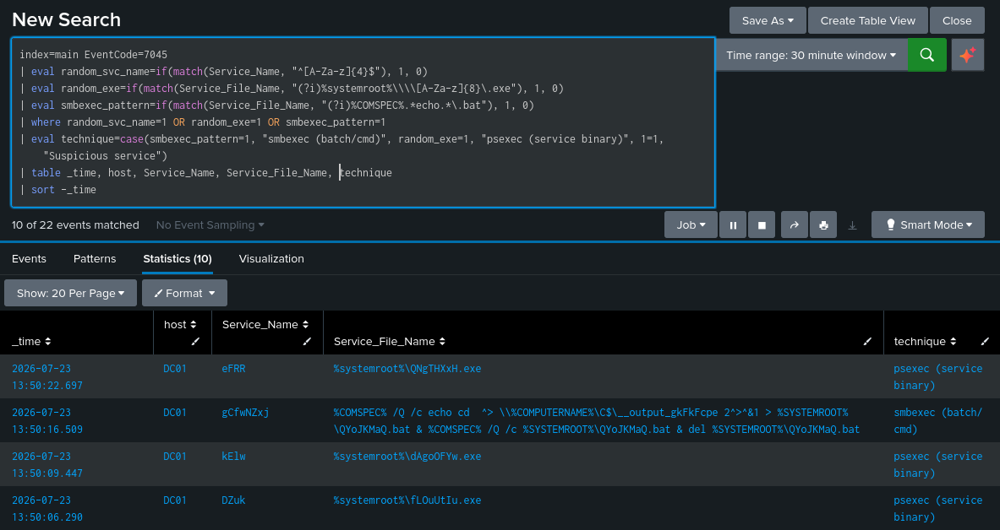

Event ID 7045 is logged locally by the Service Control Manager and doesn't carry a source IP — it records what service was created, not who triggered it. To get attribution, I correlated each 7045 with the network logon (Event ID 4624, Logon Type 3) that immediately precedes it on the same host, using `streamstats` to carry the most recent source IP forward into the service-creation event:

```
index=main host=DC01 (EventCode=7045 OR (EventCode=4624 Logon_Type=3)) earliest=-30m
| sort 0 _time
| eval svc=if(EventCode=7045, Service_Name, null())
| eval src=if(EventCode=4624, src_ip, null())
| streamstats current=f last(src) as recent_src_ip by host
| where EventCode=7045
| table _time, host, Service_Name, Service_File_Name, recent_src_ip
```

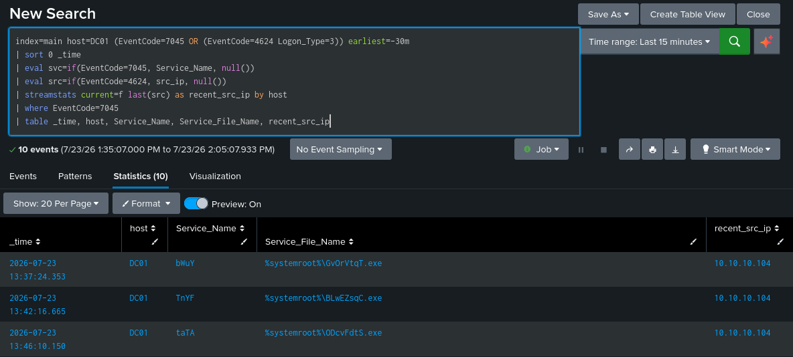

**MITRE ATT&CK:** T1550.002 — Defense Evasion / Lateral Movement (Use Alternate Authentication Material: Pass the Hash) and T1021.002 (Remote Services: SMB/Windows Admin Shares); the firewall disable is separately T1562.004 (Impair Defenses: Disable or Modify System Firewall)

**Analyst notes:** Three things came out of getting this one working. First, Defender blocking the classic Impacket toolset out of the box was itself a useful data point — the environment wasn't as permissive as I'd assumed going in. Second, disabling the firewall to get around it generated Event ID 4950, which is a high-value detection in its own right: a firewall being turned off on a domain controller mid-session is a strong signal regardless of what happens after. Third, and the most useful lesson of the whole attack: no single log entry told the full story. Service creation told me *what* happened; the preceding network logon told me *who* did it. Neither one alone was an attributable detection. Stitching them together with `streamstats` is the kind of correlation that separates a real detection from a query that just matches an event ID.

---

### Attack 6: Credential dumping (Mimikatz / LSASS)

**Scenario:** Dumped LSASS memory on CLIENT02 to extract plaintext and hashed credentials for every logged-on user, representing the standard post-compromise credential harvesting step attackers use to escalate beyond a single host.

**Attack:** From an elevated session on CLIENT02:

```
mimikatz.exe "sekurlsa::logonpasswords" exit
```

Defender deletes the Mimikatz binary on download, so it was disabled for this attack specifically.

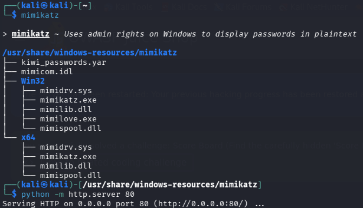

**Detection:** Attempted to verify with Sysmon Event ID 10 (ProcessAccess) targeting `lsass.exe` and got nothing back — zero results despite a successful dump:

```
index=main sourcetype="XmlWinEventLog:Microsoft-Windows-Sysmon/Operational" EventCode=10 TargetImage="*lsass.exe*"
```

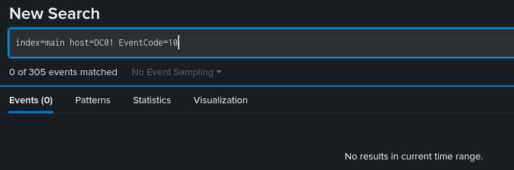

The SwiftOnSecurity config ships the `ProcessAccess` block set to `onmatch="include"` with no rules inside it — which means nothing matches the include list, which means nothing gets logged. It's not filtered, it's off. Added a targeted include rule for `lsass.exe` and reloaded Sysmon in place with `-c`, after which the same query started returning results immediately.

Final detection, scoring `GrantedAccess` values against known LSASS-read patterns and excluding processes that legitimately touch LSASS (AV engines, WMI, the service host):

```
index=main EventCode=10 TargetImage="*lsass.exe*"
| eval access_risk=case(
    GrantedAccess=="0x1010", "Read memory (0x1010) - Mimikatz sekurlsa",
    GrantedAccess=="0x1410", "Read memory (0x1410) - LSASS dump",
    GrantedAccess=="0x1438", "Full read (0x1438) - credential access",
    GrantedAccess=="0x143a", "Full read (0x143a) - Mimikatz",
    GrantedAccess=="0x1fffff", "Full access (0x1fffff) - highly suspicious",
    1=1, "Other access: ".GrantedAccess)
| eval legit=if(match(SourceImage, "(?i)(MsMpEng|wmiprvse|taskmgr|csrss|wininit|services)\.exe$"), "Possibly legitimate", "Suspicious")
| where legit="Suspicious"
| stats count, values(access_risk) as granted_access, latest(_time) as last_seen by host, SourceImage, TargetImage
| convert ctime(last_seen)
| sort -last_seen
```

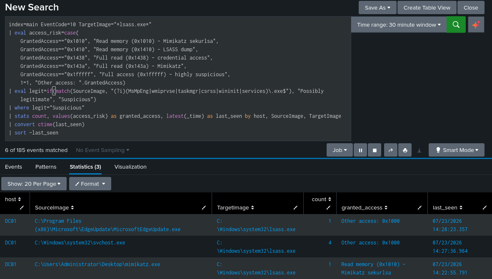

**MITRE ATT&CK:** T1003.001 — Credential Access (OS Credential Dumping: LSASS Memory)

**Analyst notes:** This is the most important finding in the whole exercise. A widely-used, well-regarded community Sysmon config ships with one of the highest-value credential-theft detections silently disabled by default, and it's not documented as a limitation anywhere obvious — you find out by attacking and getting nothing back. The design tradeoff makes sense: unrestricted ProcessAccess logging is extremely noisy. But "off by default to reduce noise" and "off by default with no indication it's off" are very different postures, and the second one is what actually shipped. Deploying a baseline Sysmon config gets you a starting point, not a finished detection capability. The only way to know a gap like this exists is to run the attack you're supposedly defending against and confirm the telemetry actually shows up — which is the whole argument for purple teaming over just reading a config and assuming it works.

---

### Attack 7: Encoded PowerShell reverse shell

**Scenario:** Launched an encoded PowerShell reverse shell from within the psexec session on DC01, representing living-off-the-land execution using a built-in interpreter instead of dropping a separate binary.

**Attack:** Generated the payload with revshells.com and ran it as a base64-encoded one-liner from the existing psexec shell:

```
powershell.exe -enc <base64 blob>
```

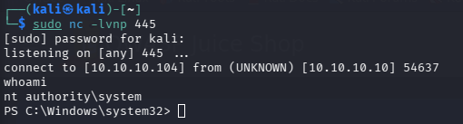

**Detection:** Checked Event ID 4104 (Script Block Logging) first, expecting the decoded script content. It didn't capture it — the psexec service context launched PowerShell as the 32-bit SysWOW64 process, and script block logging didn't behave the same way for it. Sysmon Event ID 1 (Process Creation) did catch the full command line, base64 blob included, so the detection is built there instead — decoding the payload inline with `rex` and `base64decode`:

```
index=main (EventCode=1 OR EventCode=4688)
| eval cmd=coalesce(CommandLine, Process_Command_Line)
| eval parent=coalesce(ParentImage, Parent_Process_Name)
| where match(cmd, "(?i)powershell.*(-e\s|-enc|-encodedcommand)")
| eval suspicion=case(
    match(parent, "(?i)(cmd|wmiprvse|services|psexe)\.exe$"), "High - encoded PS spawned by shell/service",
    1=1, "Medium - encoded PowerShell")
| table _time, host, parent, Image, User, suspicion, cmd
| sort -_time
```

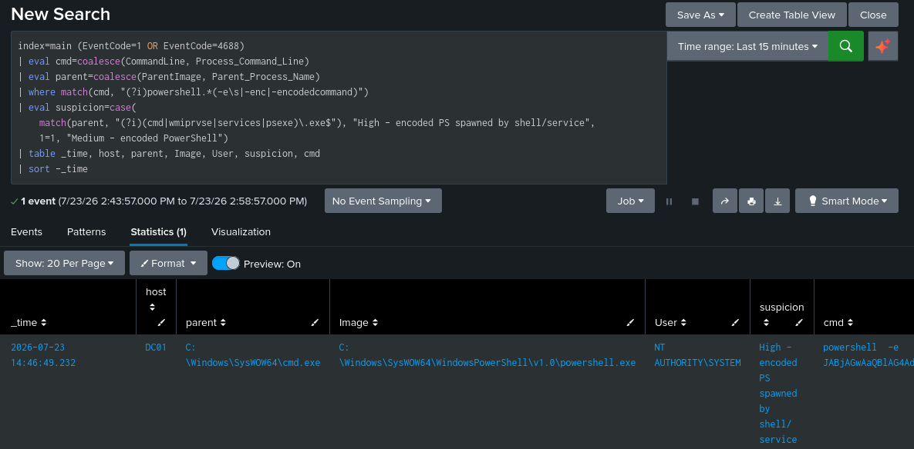
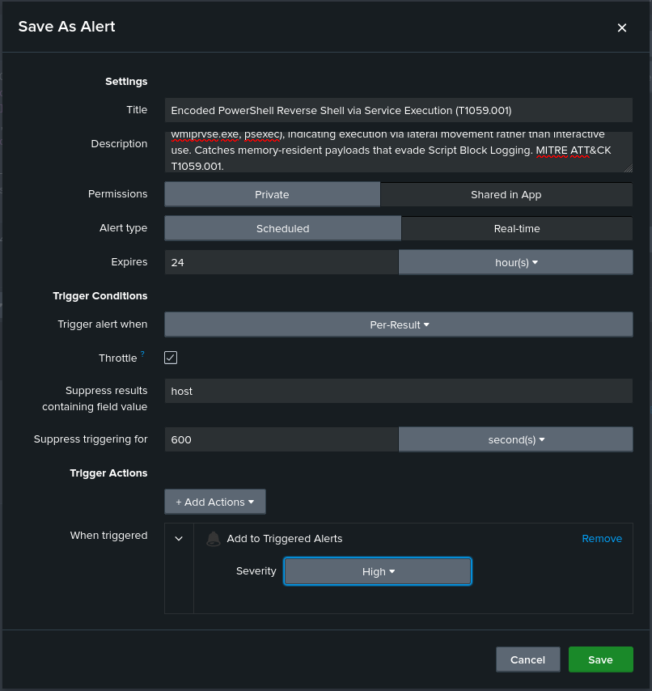

**MITRE ATT&CK:** T1059.001 — Execution (Command and Scripting Interpreter: PowerShell)

**Analyst notes:** The detection ended up depending on the fact that two logging sources cover the same activity differently, and one of them quietly failed. If Script Block Logging had been the only thing relied on here, this attack would have gone completely unlogged despite a GPO explicitly enabling it — a false sense of coverage is worse than a known gap, because nobody goes looking for it. Process Creation telemetry picked up the slack because it logs the raw command line regardless of interpreter bitness or logging subsystem quirks. The severity scoring is also doing real work here, not just cosmetic: the same encoded PowerShell command run interactively by a user is meaningfully less suspicious than the same string spawned by `cmd.exe` out of a service context, because the latter is exactly what a psexec-style lateral movement handoff looks like. Baking that parent-process context into the query turns a generic "encoded PowerShell" alert into one that actually reflects how the execution got there.

---


## Section B: OWASP Juice Shop

Attacks 8–13 target the Juice Shop instance at 10.10.10.50, running behind an nginx reverse proxy configured to log POST request bodies — without that, most of these have nothing to match against, since standard combined logging only captures the request line.

### Attack 8: SQL injection login bypass

**Scenario:** Bypassed the Juice Shop login form with a classic SQL injection payload, representing unsanitized input handling on an authentication endpoint.

**Attack:** Submitted `' OR 1=1--` as the email field on the login form.


**Detection:** The injection payload lives in the POST body, which standard nginx combined logging never captures. The custom `$request_body` log format built into the reverse proxy is what makes this detection possible at all:

```
index=main sourcetype=access_combined uri="/rest/user/login"
| regex _raw="(?i)(\'\s*or\s*1=1|union\s+select|--)"
```

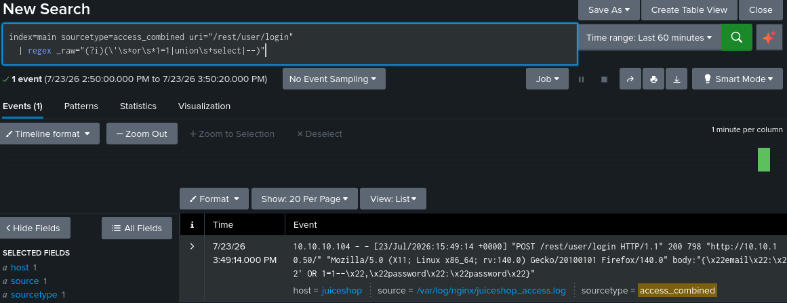

**MITRE ATT&CK:** T1190 — Initial Access (Exploit Public-Facing Application)

**Analyst notes:** This is the practical payoff of the nginx logging change made during the build. Under default combined logging, this entire attack class is invisible from the server's perspective — the log shows a `POST /rest/user/login` and a 200, with nothing to indicate why. The regex itself is intentionally loose (`OR 1=1`, `UNION SELECT`, trailing comment markers) rather than trying to match one specific payload, since injection strings vary a lot in practice and a narrow match would miss variants trivially.

---

### Attack 9: Reflected / DOM-based XSS

**Scenario:** Injected a JavaScript payload into the Juice Shop search bar, representing a client-side script injection attack.

**Attack:** Submitted `<iframe src="javascript:alert`xss`)">` into the search field.

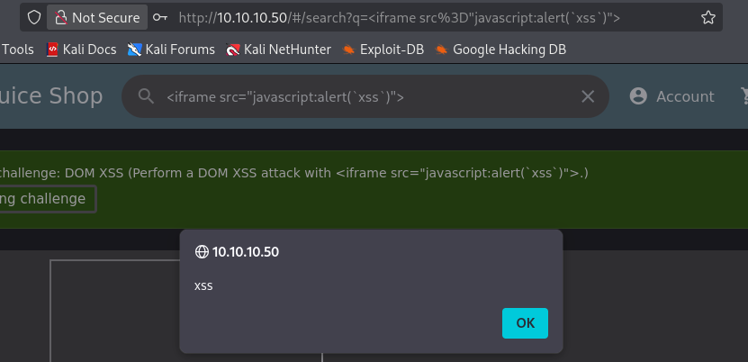

**Detection:** Attempted against the nginx access log the same way as the SQLi detection, expecting the payload to show up in the query string.

**MITRE ATT&CK:** T1189 / T1059.007 — Initial Access / Execution (Drive-by Compromise; JavaScript)

**Analyst notes:** This one doesn't have a working server-side detection, and that's the actual finding. Juice Shop's search implementation is DOM-based and delivers the payload via the URL fragment — the portion after `#` — which browsers never transmit to the server at all. The nginx access log has nothing to show because the server genuinely never sees the request. This is a hard architectural blind spot for any detection strategy that only looks at server logs, not a tuning problem. Real coverage for this class of attack requires client-side visibility: browser instrumentation, CSP violation reporting (`report-uri`), or RUM tooling — none of which existed in this lab. Rather than force a detection that doesn't reflect reality, I pivoted to the stored XSS path via product reviews, which does submit through a POST body and produced a working detection using the same approach as Attack 9. Documented here as a limitation of the lab's telemetry, not a bug to chase.

---

### Attack 10: Broken access control / IDOR

**Scenario:** Enumerated another user's shopping basket by manipulating a numeric ID in an API request, representing a missing object-level authorization check.

**Attack:** Authenticated as `attacker@lab.local`, added an item to the cart, and intercepted the resulting basket request in Burp Suite. Sent it to Repeater and walked the `basket-id` parameter through a range of values — the session's bearer token never changed, but each ID returned a different user's basket contents.

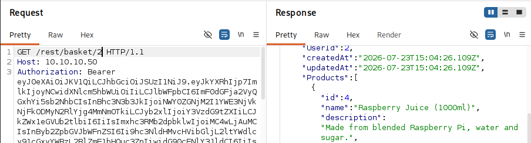

**Detection:** Keys on the behavioral pattern of ID enumeration rather than inspecting individual requests — one client hitting many distinct basket IDs in a short window, regardless of whether each individual request returns data:

```
index=main sourcetype=access_combined uri="*basket*"
| rex field=uri "basket/(?<basket_id>\d+)"
| where isnotnull(basket_id)
| bucket _time span=1m
| stats dc(basket_id) as unique_baskets, values(basket_id) as ids_accessed by clientip, _time
| where unique_baskets > 3
```

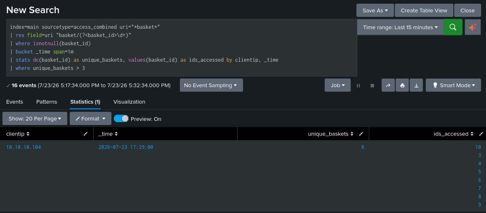

**MITRE ATT&CK:** T1190 — Initial Access (Exploit Public-Facing Application)

**Analyst notes:** The application never checked whether the authenticated user actually owned the basket ID being requested — the token was valid, so the request succeeded, full stop. A per-request detection would have nothing to key on, since every individual request in the sequence looks like a legitimate authenticated call. What makes it detectable is the pattern across requests: one authenticated session rapidly walking through sequential object IDs. Building the detection around `dc(basket_id)` in a time window catches that behavior regardless of the response code, which matters because a real attacker enumerating IDs will get plenty of 403s and 404s mixed in with the hits, and a detection that only looks at successful responses would miss most of the reconnaissance.

---

### Attack 11: Broken authentication / password reset brute force

**Scenario:** Brute-forced the security-question password reset flow to take over an account, representing weak knowledge-based authentication on a sensitive endpoint with no rate limiting.

**Attack:** Captured the reset request in Burp, sent it to Intruder, set the security-answer field as the payload position, and ran a wordlist against it.

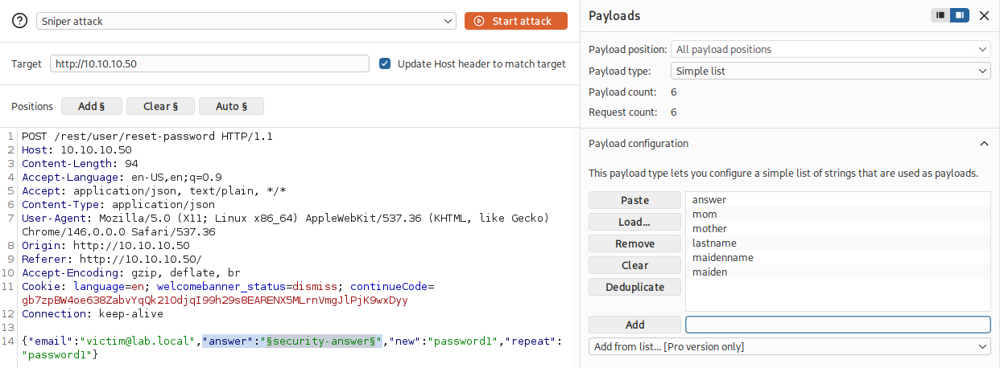

**Detection:** Buckets reset requests per minute per source, then layers in request rate, response code diversity, and user-agent to separate automated brute-forcing from normal reset traffic and to flag whether any attempt actually succeeded:

```
index=main sourcetype=access_combined uri="*reset-password*" method=POST
| bucket _time span=1m
| stats count as reset_attempts,
        dc(status) as distinct_response_codes,
        values(status) as response_codes,
        earliest(_time) as first_attempt,
        latest(_time) as last_attempt,
        values(useragent) as user_agents
        by clientip, _time
| eval duration_seconds=last_attempt-first_attempt
| eval attempts_per_sec=round(reset_attempts/(duration_seconds+1), 2)
| eval outcome=if(match(response_codes, "200"), "POSSIBLE SUCCESS - 200 response present", "no success response seen")
| where reset_attempts > 5
| eval severity=case(reset_attempts > 20, "Critical", reset_attempts > 10, "High", 1=1, "Medium")
| table _time, clientip, reset_attempts, attempts_per_sec, response_codes, outcome, severity, user_agents
| sort -reset_attempts
```

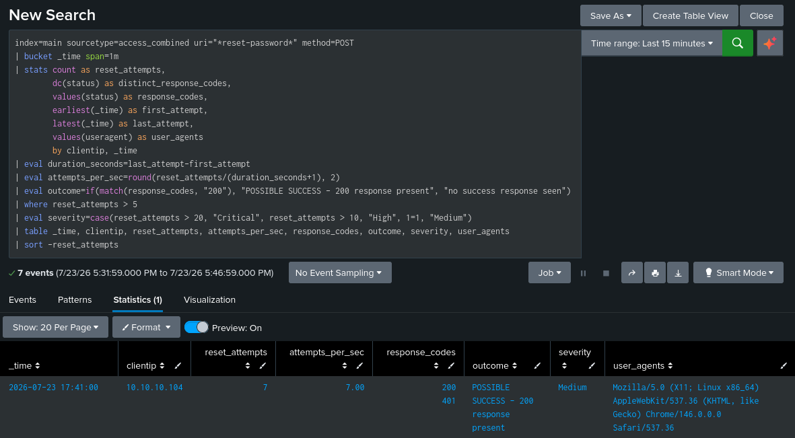

**MITRE ATT&CK:** T1110 / T1621 — Credential Access (Brute Force); Multi-Factor Authentication Request Generation (knowledge-based auth flow)

**Analyst notes:** The reset endpoint places no limit on how many security-answer guesses a single session can submit, which is what makes the brute force viable in the first place — and, not coincidentally, exactly what makes it loud enough to detect reliably. Same underlying logic as the password spray detection in Attack 4: raw volume alone is a weak signal because it can't distinguish a determined legitimate user from an attacker, so the query pairs request volume with response-code diversity and attempt rate to build a fuller picture, and explicitly calls out whether any attempt returned a 200 so the response prioritizes confirmed account takeover over noisy-but-unsuccessful attempts.

---

### Attack 12: Sensitive data exposure

**Scenario:** Accessed a confidential internal document from an unauthenticated, browsable directory, then bypassed a file-extension filter to pull backup files that were supposedly blocked.

**Attack:** Found the `/ftp` directory exposed with directory listing enabled and pulled `acquisitions.md` directly. Requesting the corresponding `.bak` file was blocked by an extension filter, but appending a null byte and a trailing `.md` (`%2500`) satisfied the filter's extension check while the underlying file handler still served the original `.bak` content.

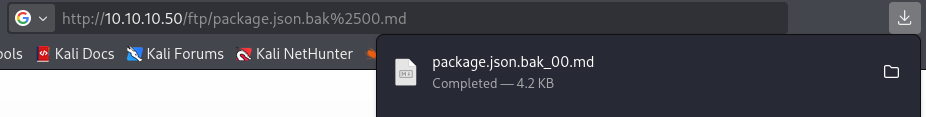

**Detection:** Flags the exposed path generally, but weights the null-byte pattern as the highest-confidence indicator since it has essentially no legitimate use case:

```
index=main sourcetype=access_combined uri="*/ftp*"
| eval alert_type=case(
    match(uri, "(?i)%00|%2500|\.bak|\.md%00|\.tar|\.gz|\.zip|backup"), "CRITICAL - filter bypass / backup file access",
    match(uri, "(?i)/ftp/?$"), "Directory listing access",
    match(uri, "(?i)confidential|acquisition|eastere"), "Confidential document access",
    1=1, "FTP folder access")
| stats count, values(uri) as accessed_paths, values(status) as response_codes by clientip, alert_type
| sort -count
```

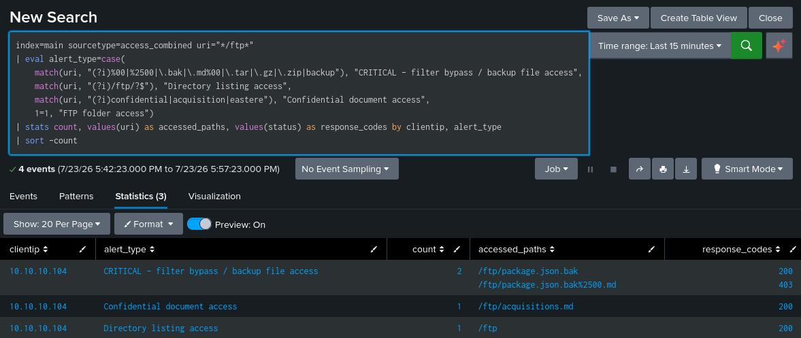

**MITRE ATT&CK:** T1213 — Collection (Data from Information Repositories)

**Analyst notes:** The null-byte bypass is the highest-confidence single signal in this entire writeup. Legitimate browser and application traffic never sends a literal null byte in a URL — there's no scenario where a real user's request contains `%2500`. Path-based matching on `/ftp` or filenames like "confidential" catches the broader exposure but is inherently fuzzier, since those strings could theoretically appear in benign requests. The null byte has effectively zero false-positive surface, which makes it worth weighting separately from the rest of the detection rather than treating all matches as equally severe. It's also a clean illustration of why extension-based filtering isn't a real access control: the filter checked what the URL string ended in, not what file was actually resolved and served.

---

### Attack 13: Automated scanning

**Scenario:** Ran a full OWASP ZAP active scan against the Juice Shop instance, representing tool-driven reconnaissance and vulnerability probing rather than manual, targeted exploitation.

**Attack:**

```
zaproxy
```

Kicked off an Automated Scan against `http://10.10.10.50:3000`. ZAP spidered the app to map endpoints, then ran active scans firing test payloads at everything it found — roughly 12,000 requests inside 60 minutes.

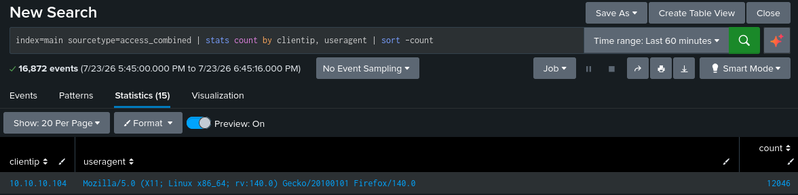

**Detection:** Deliberately behavioral rather than signature-based — request volume and endpoint breadth per source per minute, with no dependency on scanner user-agent strings, which are trivially spoofed:

```
index=main sourcetype=access_combined
| bucket _time span=1m
| stats count as requests,
        dc(uri) as unique_uris,
        dc(status) as distinct_statuses
        by clientip, _time
| eval detection=case(
    requests > 100, "Critical - very high request volume",
    requests > 50 AND unique_uris > 50, "High - broad endpoint enumeration",
    requests > 50, "Medium - elevated request volume",
    1=1, "elevated activity")
| where requests > 50 OR unique_uris > 50
| sort -requests
```

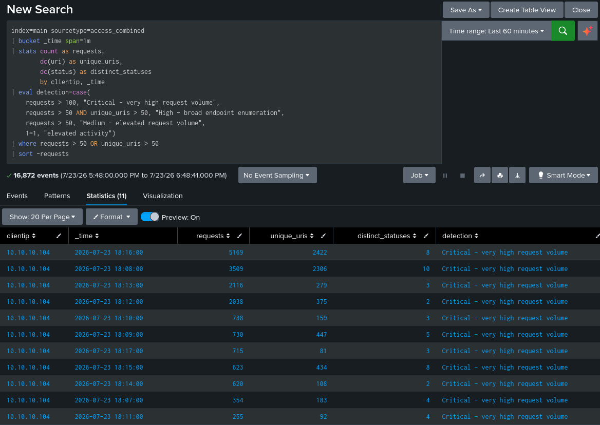

**MITRE ATT&CK:** T1595.002 — Reconnaissance (Active Scanning: Vulnerability Scanning)

**Analyst notes:** The contrast with the rest of this writeup is the real takeaway. Every manual attack in Sections A and B produced a handful of deliberate, low-volume requests — that's what makes techniques like the IDOR and password reset attacks require behavioral detection in the first place, since there's no volume to key on. ZAP inverted that completely: broad, fast, high-volume coverage across every endpoint it could find, which is a fundamentally different and much easier telemetry signature to catch. Building the detection on request volume and endpoint breadth instead of the `ZAP` user-agent string was a deliberate choice — a real attacker running a scanner will change the user-agent in about ten seconds, but they can't easily disguise the fact that one source is hitting fifty distinct endpoints inside a minute without still generating that volume. It's also a clean demonstration of the tradeoff between automated and manual testing: ZAP got broad coverage fast, but at a volume that's nearly impossible to run quietly.

---

## Summary

| # | Attack | MITRE ATT&CK | Detection Source | Key Finding |
|---|---|---|---|---|
| 1 | Network/service discovery (nmap) | T1046 | — (undetected) | Host telemetry structurally blind to filtered scans; requires network-layer visibility |
| 2 | Kerberoasting | T1558.003 | Event 4769 (RC4) | Threshold `>3` produced a false negative; single event is conclusive |
| 3 | AS-REP Roasting | T1558.004 | Event 4768 (no pre-auth) | Zero credentials required; any occurrence is high severity |
| 4 | Password spraying | T1110.003 | Events 4625/4776 | netexec uses NTLM not Kerberos; detection keys on distinct-account count |
| 5 | Lateral movement (psexec) | T1550.002 / T1021.002 | Event 7045 + 4624 (correlated) | Defender blocked all three Impacket tools until firewall disabled (T1562.004) |
| 6 | Credential dumping (Mimikatz) | T1003.001 | Sysmon Event 10 | SwiftOnSecurity config ships ProcessAccess logging silently disabled |
| 7 | Encoded PowerShell reverse shell | T1059.001 | Sysmon Event 1 | 32-bit PowerShell broke Script Block Logging; process creation caught it instead |
| 8 | SQL injection login bypass | T1190 | nginx access + body log | Default combined logging never captures POST bodies where payload lives |
| 9 | DOM-based XSS | T1189 / T1059.007 | — (undetected) | URL fragment never reaches the server; requires client-side visibility |
| 10 | IDOR / broken access control | T1190 | nginx access log | Detection on ID enumeration pattern, not per-request inspection |
| 11 | Password reset brute force | T1110 / T1621 | nginx access log | No rate limiting on reset endpoint; detection on volume + response diversity |
| 12 | Sensitive data exposure | T1213 | nginx access log | Null-byte bypass is near-zero false-positive signal |
| 13 | Automated scanning (ZAP) | T1595.002 | nginx access log | Behavioral detection avoids relying on spoofable user-agent strings |

Two of the thirteen attacks — the nmap scan and the DOM-based XSS — don't have a working detection in this lab, and that's intentional. Both are documented as genuine visibility gaps rather than tuned around, because the honest output of a purple team exercise isn't "everything got caught," it's an accurate map of what your current telemetry can and can't see. The rest required real tuning: adjusting thresholds against actual attack data, correlating multiple event sources to recover attribution a single log couldn't provide, and finding — and fixing — a default Sysmon config that silently dropped one of the highest-value credential-theft detections in the whole build.

Environment build and full network/host configuration: [<u>Purple Team SOC Lab — Environment Build</u>](/socdocs/purple-team-soc-lab---environment-build/).
