## Overview

This is the build documentation for a self-contained purple team lab I put together from scratch. The goal was to simulate a realistic small enterprise environment — Active Directory domain, a domain-joined client workstation, a web application target, and a Splunk SIEM with full log coverage — that I could attack and detect against in a controlled, isolated setting.

The attack and detection work is documented in the companion writeup: [<u>Purple Team SOC Lab — Attack & Detect</u>](/socdocs/purple-team-soc-lab---attack--detect/).

---

## Architecture

Everything runs on an isolated VMware internal network behind pfSense. The only path to the internet is through pfSense itself via NAT, used only for updates. Nothing else touches the home network.


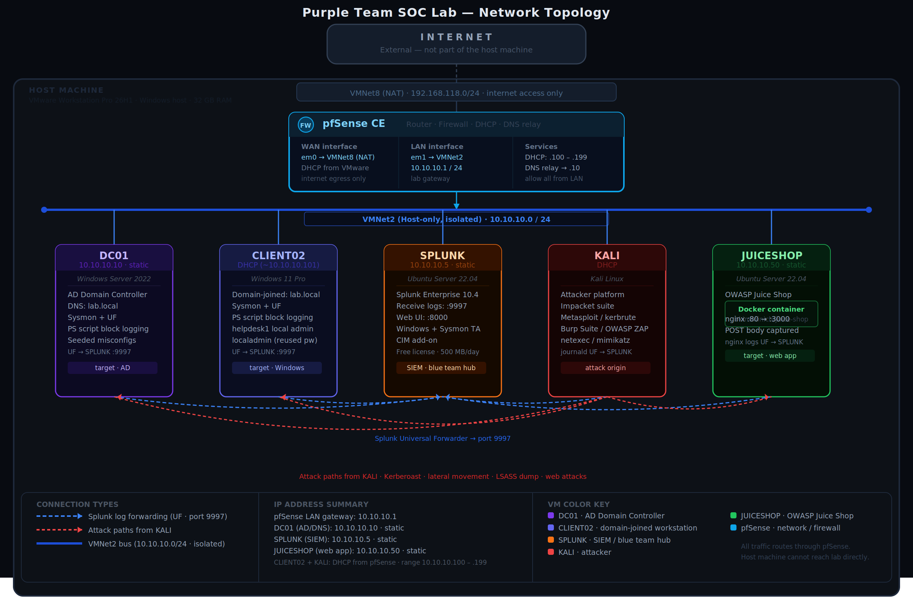


| VM | Role | OS | IP |
|---|---|---|---|
| pfSense | Router / Firewall / DHCP | pfSense CE | 10.10.10.1 |
| DC01 | Active Directory / DNS | Windows Server 2022 | 10.10.10.10 |
| CLIENT02 | Domain-joined workstation | Windows 11 Pro | DHCP (10.10.10.101) |
| SPLUNK | SIEM | Ubuntu Server 22.04 + Splunk Enterprise | 10.10.10.5 |
| KALI | Attacker | Kali Linux | DHCP (10.10.10.104) |
| JUICESHOP | Vulnerable web app | Ubuntu Server 22.04 + Docker | 10.10.10.50 |

**Why pfSense?** It acts as the single choke point between the lab and the internet, handles DHCP for the entire internal network, and keeps the lab completely isolated from the home LAN. The intentionally vulnerable machines stay contained.

---

## 1. Network Setup

Before any VMs, the virtual network has to be configured correctly. Everything else depends on getting this right.

### VMware Virtual Network Editor

Open VMware Workstation and navigate to **Edit → Virtual Network Editor**.

The goal is two virtual switches:

- **VMNet8 (NAT)** — already exists by default. This is pfSense's WAN interface. Only pfSense touches it.
- **VMNet2 (Host-only, isolated)** — needs to be created. Every other VM lives here.

To create VMNet2:

1. Click **Add Network**, select VMNet2
2. Set type to **Host-only**
3. Uncheck **Connect a host virtual adapter to this network** — the host machine should not be on the lab segment
4. Uncheck **Use local DHCP service to distribute IP addresses to VMs** — pfSense handles DHCP, and running two DHCP servers on the same segment is exactly the kind of thing that costs you an afternoon
5. Set the subnet to `10.10.10.0` / `255.255.255.0`

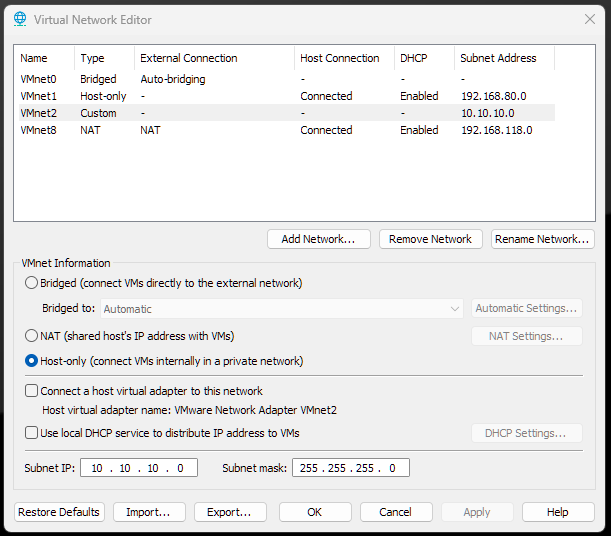

---

## 2. pfSense

### VM Setup

Create a new VM using the pfSense CE ISO:

- **Disk:** 12GB
- **RAM:** 1GB
- **CPUs:** 1
- **Network Adapter 1:** NAT (VMNet8) — WAN
- **Network Adapter 2:** Custom → VMNet2 — LAN

Before first boot, make sure both network adapters are assigned correctly.

### Installation

Boot the ISO and go through the installer with default options. When prompted to select the WAN interface, select **em0** (the first adapter, mapped to VMNet8). LAN is **em1**.

For the LAN setup, the installer defaults to `192.168.1.1`. Since the lab uses `10.10.10.0/24`, update the following:

- **Interface Mode:** Static
- **IP Address:** `10.10.10.1/24`
- **DHCP range start:** `10.10.10.100`
- **DHCP range end:** `10.10.10.199`

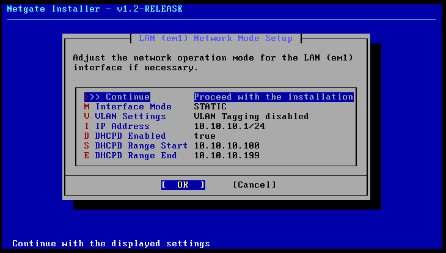

Once installed, browse to `https://10.10.10.1` from any machine on VMNet2 (after they're setup). Default credentials are `admin/pfsense` — change these immediately.

### Web UI Configuration

**DHCP Server (Services → DHCP Server → LAN):**
Confirm DHCP is enabled. Under **DNS Servers**, set the first entry to `10.10.10.10`. This is DC01's IP — once the domain is up, every DHCP lease will automatically point at AD-integrated DNS.

**Firewall (Firewall → Rules → LAN):**
The default "allow all from LAN" rules are fine. The isolation is already handled at the VMware level.

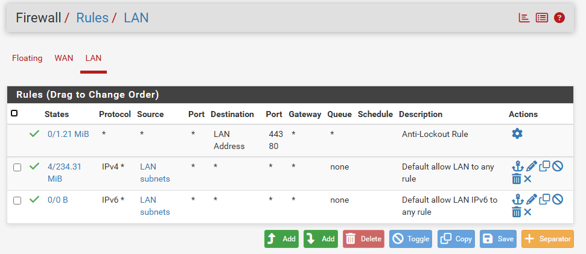

---

## 3. DC01 — Windows Server 2022

### VM Setup

- **RAM:** 4GB
- **CPUs:** 2
- **Disk:** 60GB (single file)
- **Network Adapter:** Custom → VMNet2
- **CD/DVD:** Windows Server 2022 ISO

### Install Gotcha — Floppy Drive

On first boot, this error appeared:

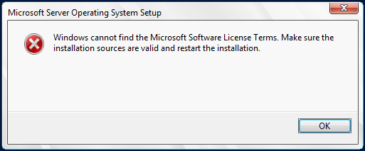

VMware adds a virtual floppy drive by default, and it interferes with the UEFI boot sequence. The fix is to shut down the VM, go to VM Settings → Hardware → Floppy, and uncheck **Connect at power on**. Powering back on after that resolved it immediately.

### Installation

Select **Windows Server 2022 Standard (Desktop Experience)** — the GUI is needed for managing AD, Group Policy, and DNS.

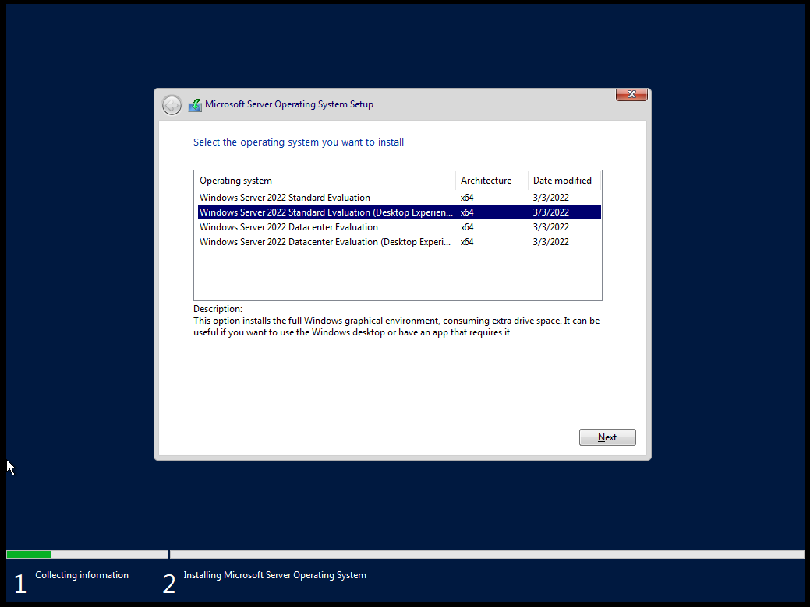

Select **Custom install** and use the default unallocated 60GB disk.

### Static IP

DC01 needs a fixed address because it's the DNS server for the domain. Navigate to Network Settings → adapter Properties → IPv4 Properties:

- **IP Address:** `10.10.10.10`
- **Subnet Mask:** `255.255.255.0`
- **Default Gateway:** `10.10.10.1`
- **Preferred DNS:** `127.0.0.1`

Pointing DNS at `127.0.0.1` looks wrong but it's correct — once AD DS is installed, DC01 will be running its own DNS server and needs to resolve through itself.

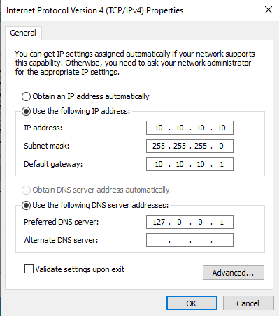

### Active Directory Domain Services

**Server Manager → Add Roles and Features → Active Directory Domain Services → Install.**

After install, click the post-deployment notification to **Promote this server to a domain controller:**

- **Add a new forest**
- **Root domain name:** `lab.local`
- Set a DSRM password
- Leave everything else default

After the reboot, DC01 is the domain controller for `lab.local` and is running AD-integrated DNS.

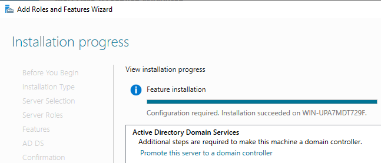

Go back into the pfSense web UI and update the DHCP DNS server to `10.10.10.10` so all future leases resolve through DC01.

---

## 4. CLIENT02 — Windows 11 Pro

### VM Setup

- **RAM:** 4GB
- **CPUs:** 2
- **Disk:** 64GB (single file)
- **Network Adapter:** Custom → VMNet2

Before powering on, disconnect the network adapter in VM Settings (uncheck **Connected** and **Connect at power on**). This is needed to bypass the Microsoft account requirement during setup.

### Bypassing the Microsoft Account Requirement

When setup reaches the network page, press **Shift + F10** to open a command prompt and run:

```
OOBE\BYPASSNRO
```

The machine reboots into OOBE. This time there's an **"I don't have internet"** option — click that, then **"Continue with limited setup"** to create a local account.

After setup finishes, shut down, reconnect the network adapter in VM Settings, and boot back up.


### Domain Join

Confirm networking is working:

```
ipconfig /all
nslookup lab.local
```

DNS should show `10.10.10.10` and `nslookup` should return DC01's IP. Then join the domain via **Win + R → `sysdm.cpl` → Computer Name → Change → Domain: `lab.local`**. Authenticate with the DC01 administrator credentials when prompted.

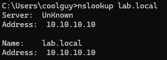

After the reboot, log in as `LAB\Administrator` to confirm the join. CLIENT02 should appear under **Computers** in Active Directory Users and Computers on DC01.

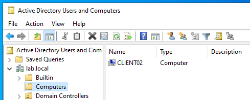

---

## 5. SPLUNK — Ubuntu Server 22.04

### VM Setup

- **RAM:** 4GB
- **CPUs:** 2
- **Disk:** 40GB (single file)
- **Network Adapter:** Custom → VMNet2

### Ubuntu Install and Static IP

During the network configuration step, switch the interface from DHCP to manual:

- **Subnet:** `10.10.10.0/24`
- **Address:** `10.10.10.5`
- **Gateway:** `10.10.10.1`
- **Name servers:** `10.10.10.10`
- **Search domains:** `lab.local`

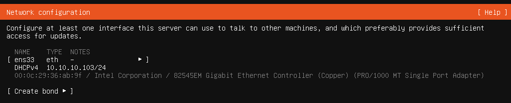
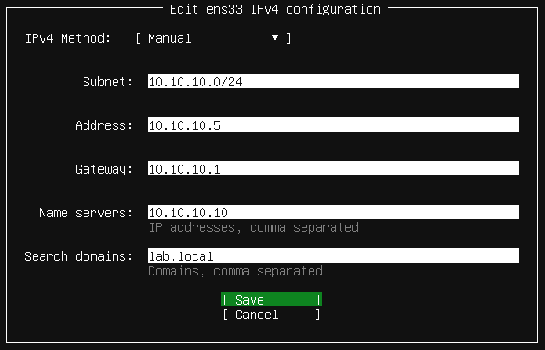

Use the standard **Ubuntu Server** option (not minimized). Enable OpenSSH during the install.

### Splunk Enterprise

SSH into SPLUNK from another machine on the network, download the `.deb` package from `splunk.com`, and install:

```bash
sudo dpkg -i splunk*.deb
sudo /opt/splunk/bin/splunk start --accept-license --run-as-root
sudo /opt/splunk/bin/splunk enable boot-start
```

Navigate to `http://10.10.10.5:8000` from KALI or DC01 and confirm the web UI loads. Enable the receiving port for forwarders: **Settings → Forwarding and receiving → Configure receiving → New → 9997**.

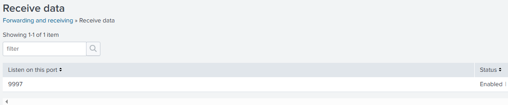

### LVM Extension

Ubuntu's installer allocates roughly half the disk to the root logical volume by default, leaving the rest unallocated in the volume group. Splunk refused to run searches until free space was above its 5GB threshold. Extending the volume fixed it:

```bash
sudo lvextend -l +100%FREE /dev/mapper/ubuntu--vg-ubuntu--lv
sudo resize2fs /dev/mapper/ubuntu--vg-ubuntu--lv
df -h
```

The root filesystem went from ~19GB to ~38GB available.

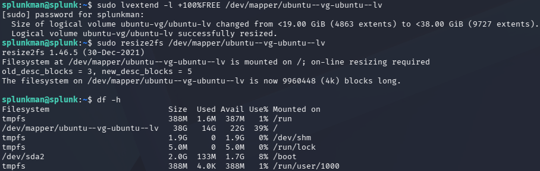

### Splunkbase Add-ons

Download these three apps from `splunkbase.splunk.com` and transfer them to SPLUNK via `scp` from KALI:

- **Splunk Add-on for Microsoft Windows** — parses Windows Event Log channels into proper fields
- **Splunk Add-on for Sysmon** — parses Sysmon event data
- **Splunk Common Information Model (CIM)** — normalizes field names across sourcetypes

Install via CLI and restart:

```bash
sudo /opt/splunk/bin/splunk install app /tmp/splunk-add-on-for-microsoft-windows_*.spl -auth admin:<password>
sudo /opt/splunk/bin/splunk install app /tmp/splunk-add-on-for-sysmon_*.spl -auth admin:<password>
sudo /opt/splunk/bin/splunk install app /tmp/splunk-common-information-model-cim_*.tgz -auth admin:<password>
sudo /opt/splunk/bin/splunk restart
```

---

## 6. KALI

### VM Setup

- **RAM:** 4GB
- **CPUs:** 2
- **Disk:** 60GB (single file)
- **Network Adapter:** Custom → VMNet2

Select **Graphical Install** at boot. During setup:

- **Hostname:** `kali`
- **Domain name:** leave blank — Kali isn't joining the domain
- **Partition:** Guided, entire disk, all files in one partition
- **Software selection:** Kali Linux Default (not Everything)
- **GRUB:** install to `/dev/sda`

After install, update:

```bash
sudo apt update && sudo apt full-upgrade -y
```

Verify networking:

```bash
ip a
ping 10.10.10.1 -c 2
ping 8.8.8.8 -c 2
```

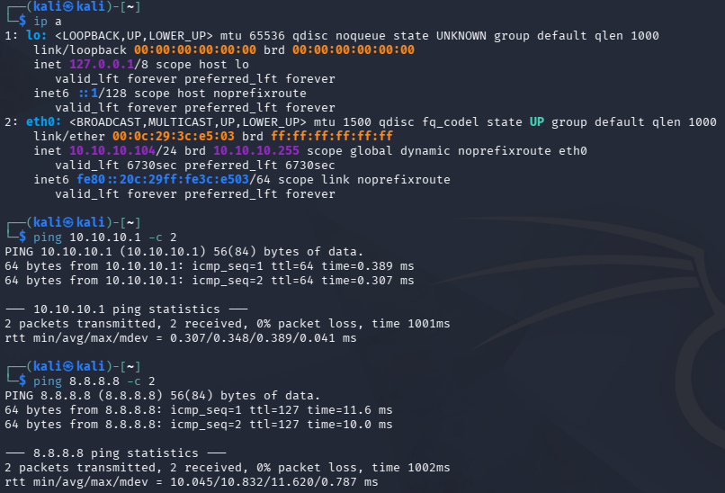

### Splunk Universal Forwarder

Kali uses systemd's journald for logging by default — `/var/log/auth.log` and `/var/log/syslog` don't exist because rsyslog isn't installed. Rather than adding rsyslog, the journal is forwarded directly.

Enable persistent journal storage:

```bash
sudo mkdir -p /var/log/journal
sudo systemd-tmpfiles --create --prefix /var/log/journal
sudo systemctl restart systemd-journald
```

Download the 64-bit `.deb` Universal Forwarder from `splunk.com` and install:

```bash
sudo dpkg -i splunkforwarder*.deb
sudo /opt/splunkforwarder/bin/splunk start --accept-license
sudo /opt/splunkforwarder/bin/splunk add forward-server 10.10.10.5:9997 -auth admin:<password>
sudo /opt/splunkforwarder/bin/splunk enable boot-start
```

Add the forwarder's user to the `systemd-journal` group so it can read journal files:

```bash
sudo usermod -aG systemd-journal kali
```

Create `/opt/splunkforwarder/etc/system/local/inputs.conf`:

```ini
[monitor:///var/log/journal]
disabled = 0
index = main
```

Restart the forwarder, then generate a test event to confirm the pipeline:

```bash
sudo /opt/splunkforwarder/bin/splunk restart
logger "test message from kali"
```

On Splunk Web UI, go to `http://10.10.10.5:8000/en-US/app/search/search` and run this query to verify data is flowing `index=* | stats count by host, sourcetype`

If Kali is listed, good to go.

---

## 7. JUICESHOP — OWASP Juice Shop

### VM Setup

Same install process as SPLUNK — Ubuntu Server 22.04, static IP `10.10.10.50`, VMNet2. Set the server name to `juiceshop`.

### Docker and Juice Shop

```bash
curl -fsSL https://get.docker.com | sudo sh
sudo usermod -aG docker $USER
```

Log out and back in, then pull and start the container. The `NODE_ENV=unsafe` flag unlocks the full challenge set instead of the trimmed default:

```bash
docker pull bkimminich/juice-shop
docker run -d -e "NODE_ENV=unsafe" -p 3000:3000 --restart unless-stopped bkimminich/juice-shop
```

Verify from KALI:

```bash
curl -s http://10.10.10.50:3000 | grep -i juice
```

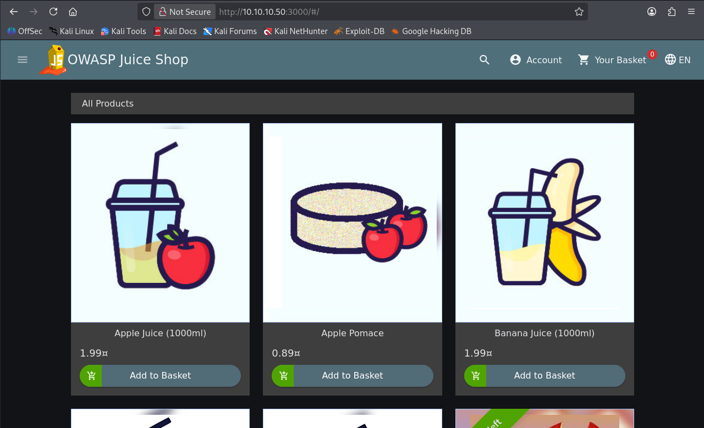

Juice Shop's built-in scoreboard at `http://10.10.10.50:3000/#/score-board` timestamps completed challenges, which is useful for viewing attacks and progress.

### Nginx Reverse Proxy for HTTP Logging

Docker's default JSON logging captures application-level stdout but not structured HTTP fields. Without URI, query string, and user-agent fields, most of the web attack detections in Part 2 have nothing to match against.

The fix is an nginx reverse proxy in front of the container with a custom log format that includes the request body — where POST payloads like SQL injection strings actually live:

```bash
sudo apt install nginx -y
```

Create `/etc/nginx/sites-available/juiceshop`:

```nginx
log_format juiceshop_bodylog '$remote_addr - $remote_user [$time_local] '
                             '"$request" $status $body_bytes_sent '
                             '"$http_referer" "$http_user_agent" '
                             'body:"$request_body"';

server {
    listen 80;
    server_name 10.10.10.50;

    access_log /var/log/nginx/juiceshop_access.log juiceshop_bodylog;
    error_log  /var/log/nginx/juiceshop_error.log;

    location / {
        proxy_pass http://127.0.0.1:3000;
        proxy_set_header Host $host;
        proxy_set_header X-Real-IP $remote_addr;
        proxy_set_header X-Forwarded-For $proxy_add_x_forwarded_for;
        proxy_set_header X-Forwarded-Proto $scheme;

        proxy_http_version 1.1;
        proxy_set_header Upgrade $http_upgrade;
        proxy_set_header Connection "upgrade";
    }
}
```

Enable the site and reload:

```bash
sudo ln -s /etc/nginx/sites-available/juiceshop /etc/nginx/sites-enabled/
sudo rm /etc/nginx/sites-enabled/default
sudo nginx -t
sudo systemctl reload nginx
```

From KALI, confirm Juice Shop is reachable on port 80:

```bash
curl -s http://10.10.10.50 | grep -i juice
```

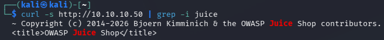

Install the Splunk Universal Forwarder on JUICESHOP (same process as KALI, using `.deb`), then configure `inputs.conf` to monitor the nginx logs:

```ini
[monitor:///var/log/nginx/juiceshop_access.log]
disabled = 0
index = main
sourcetype = access_combined

[monitor:///var/log/nginx/juiceshop_error.log]
disabled = 0
index = main
sourcetype = nginx_error
```

nginx logs are readable only by the `adm` group. Add the forwarder's user:

```bash
sudo usermod -aG adm juiceman
sudo /opt/splunkforwarder/bin/splunk restart
```

---

## 8. Active Directory Configuration

### OU Structure and User Accounts

All lab accounts live in a dedicated OU (`LabUsers`) to keep things organized and easy to clean up if needed. Six standard user accounts were created across various roles — accounting, marketing, HR, sales, operations — to give the domain realistic background activity so that anomalous behavior stands out against it.

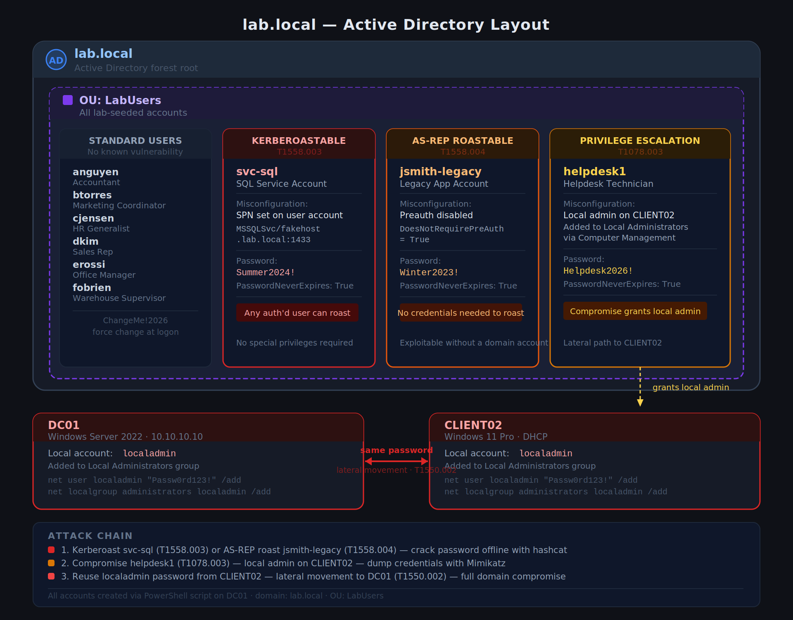


The full setup was automated with this PowerShell script run on DC01.

```powershell
<#
.SYNOPSIS
    Seeds lab.local with fake users, varying privilege levels, and deliberate
    AD misconfigurations (Kerberoastable SPN, AS-REP roastable account) for
    a SOC home lab attack/detect exercise.

.NOTES
    Run this ON DC01, in an elevated PowerShell window, as a Domain Admin.
    Safe to re-run — it checks for existing objects before creating them.
#>

Import-Module ActiveDirectory

# ---------------------------------------------------------------------------
# 1. Create an OU to keep lab objects organized and easy to find/clean up
# ---------------------------------------------------------------------------
$ouName = "LabUsers"
$ouPath = "OU=$ouName,DC=lab,DC=local"

if (-not (Get-ADOrganizationalUnit -Filter "Name -eq '$ouName'" -ErrorAction SilentlyContinue)) {
    New-ADOrganizationalUnit -Name $ouName -Path "DC=lab,DC=local"
    Write-Host "Created OU: $ouPath" -ForegroundColor Green
}

# ---------------------------------------------------------------------------
# 2. Create a batch of "normal" fake users at varying privilege levels
#    (regular employees — the noise/realism layer of the domain)
# ---------------------------------------------------------------------------
$normalUsers = @(
    @{First="Alice";  Last="Nguyen";   Title="Accountant"},
    @{First="Brian";  Last="Torres";   Title="Marketing Coordinator"},
    @{First="Carla";  Last="Jensen";   Title="HR Generalist"},
    @{First="David";  Last="Kim";      Title="Sales Rep"},
    @{First="Elena";  Last="Rossi";    Title="Office Manager"},
)

foreach ($u in $normalUsers) {
    $sam = ($u.First.Substring(0,1) + $u.Last).ToLower()
    if (-not (Get-ADUser -Filter "SamAccountName -eq '$sam'" -ErrorAction SilentlyContinue)) {
        New-ADUser -Name "$($u.First) $($u.Last)" `
            -GivenName $u.First -Surname $u.Last `
            -SamAccountName $sam -UserPrincipalName "$sam@lab.local" `
            -Path $ouPath -Title $u.Title `
            -AccountPassword (ConvertTo-SecureString "ChangeMe!2026" -AsPlainText -Force) `
            -Enabled $true -ChangePasswordAtLogon $true
        Write-Host "Created user: $sam ($($u.Title))" -ForegroundColor Green
    }
}

# ---------------------------------------------------------------------------
# 3. Create a "helpdesk" account and add it as a local admin on WIN11
#    (a juicy account for privilege escalation demos)
# ---------------------------------------------------------------------------
$helpdeskSam = "helpdesk1"
$helpdeskPw = "Helpdesk2026!"   # deliberately memorable/weak-ish for the lab

if (-not (Get-ADUser -Filter "SamAccountName -eq '$helpdeskSam'" -ErrorAction SilentlyContinue)) {
    New-ADUser -Name "Help Desk" -SamAccountName $helpdeskSam `
        -UserPrincipalName "$helpdeskSam@lab.local" -Path $ouPath `
        -Title "Helpdesk Technician" `
        -AccountPassword (ConvertTo-SecureString $helpdeskPw -AsPlainText -Force) `
        -Enabled $true -PasswordNeverExpires $true
    Write-Host "Created helpdesk account: $helpdeskSam / $helpdeskPw" -ForegroundColor Yellow
    Write-Host "  --> Manually add this account to the local Administrators group on WIN11" -ForegroundColor Yellow
    Write-Host "      (Computer Management > Local Users and Groups > Administrators > Add)" -ForegroundColor Yellow
}

# ---------------------------------------------------------------------------
# 4. Create a Kerberoastable service account
#    (SPN set on a user account with password-never-expires, weak password)
# ---------------------------------------------------------------------------
$svcSam = "svc-sql"
$svcPw = "Summer2024!"   # deliberately weak/crackable for the demo

if (-not (Get-ADUser -Filter "SamAccountName -eq '$svcSam'" -ErrorAction SilentlyContinue)) {
    New-ADUser -Name "SQL Service Account" -SamAccountName $svcSam `
        -UserPrincipalName "$svcSam@lab.local" -Path $ouPath `
        -Description "Service account for fake SQL instance" `
        -AccountPassword (ConvertTo-SecureString $svcPw -AsPlainText -Force) `
        -Enabled $true -PasswordNeverExpires $true

    # Set an SPN on it -- this is what makes it Kerberoastable.
    # Format: service-class/hostname:port  (mssql on a fake host here)
    Set-ADUser -Identity $svcSam -ServicePrincipalNames @{Add="MSSQLSvc/fakehost.lab.local:1433"}

    Write-Host "Created Kerberoastable account: $svcSam / $svcPw" -ForegroundColor Yellow
    Write-Host "  --> SPN set: MSSQLSvc/fakehost.lab.local:1433" -ForegroundColor Yellow
}

# ---------------------------------------------------------------------------
# 5. Create an AS-REP roastable account
#    (Kerberos preauthentication disabled)
# ---------------------------------------------------------------------------
$asrepSam = "jsmith-legacy"
$asrepPw = "Winter2023!"   # deliberately weak/crackable for the demo

if (-not (Get-ADUser -Filter "SamAccountName -eq '$asrepSam'" -ErrorAction SilentlyContinue)) {
    New-ADUser -Name "J Smith (Legacy App Account)" -SamAccountName $asrepSam `
        -UserPrincipalName "$asrepSam@lab.local" -Path $ouPath `
        -Description "Legacy account, preauth disabled for old app compatibility" `
        -AccountPassword (ConvertTo-SecureString $asrepPw -AsPlainText -Force) `
        -Enabled $true -PasswordNeverExpires $true

    # This is the flag that makes it AS-REP roastable
    Set-ADAccountControl -Identity $asrepSam -DoesNotRequirePreAuth $true

    Write-Host "Created AS-REP roastable account: $asrepSam / $asrepPw" -ForegroundColor Yellow
    Write-Host "  --> DoesNotRequirePreAuth = True" -ForegroundColor Yellow
}

Write-Host ""
Write-Host "=== Done. Summary of intentionally weak/juicy accounts ===" -ForegroundColor Cyan
Write-Host "Kerberoastable:      $svcSam / $svcPw"
Write-Host "AS-REP roastable:    $asrepSam / $asrepPw"
Write-Host "Helpdesk (local admin on WIN11 -- add manually): $helpdeskSam / $helpdeskPw"
Write-Host ""
```

### Seeded Misconfigurations

Four deliberate weaknesses were introduced, each chosen because it maps to a real-world attack technique, is exploitable with standard tooling, and produces a detectable signal in Windows Event Logs or Sysmon:

| # | Misconfiguration | Account | Technique Enabled | MITRE ATT&CK |
|---|---|---|---|---|
| 1 | SPN registered on a standard user account with a weak password | `svc-sql` | Kerberoasting | T1558.003 |
| 2 | Kerberos pre-authentication disabled | `jsmith-legacy` | AS-REP Roasting | T1558.004 |
| 3 | Domain account granted local admin rights on CLIENT02 | `helpdesk1` | Privilege Escalation | T1078.003 |
| 4 | Identical local Administrator password on DC01 and CLIENT02 | Local `Administrator` (both hosts) | Lateral Movement | T1550.002 |

Together they form a realistic attack chain: Kerberoast or AS-REP roast a service account for credentials, escalate to local admin via the helpdesk account, and move laterally to the domain controller using the reused local admin password — mirroring how many real breaches escalate from initial access to full domain compromise.

### Local Admin Account

Run on both DC01 and CLIENT02 to create the reused credential used in the lateral movement attack:

```
net user localadmin "Passw0rd123!" /add
net localgroup administrators localadmin /add
```

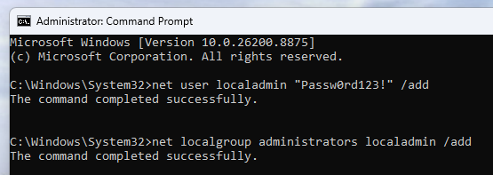
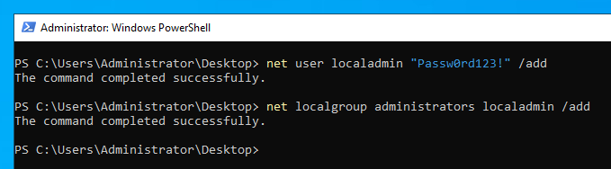


Verify the AD configuration:

```powershell
Get-ADUser -Filter * -Properties ServicePrincipalNames, DoesNotRequirePreAuth
```

---

## 9. Sysmon and Splunk Universal Forwarder — DC01 and CLIENT02

### Sysmon

On both Windows machines, create `C:\Tools\Sysmon` and place the following files inside:

1. **Sysmon64.exe** from `learn.microsoft.com/en-us/sysinternals/downloads/sysmon`
2. **sysmonconfig-export.xml** from `raw.githubusercontent.com/SwiftOnSecurity/sysmon-config/refs/heads/master/sysmonconfig-export.xml`

Install with the config from an admin command prompt:

```powershell
.\Sysmon64.exe -accepteula -i sysmonconfig-export.xml

# Verify that the service is running 
sc query Sysmon64
```

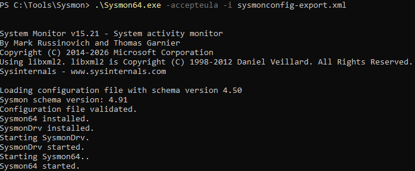
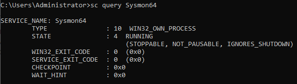


**One gap worth calling out:** the SwiftOnSecurity config ships with `ProcessAccess` (Event ID 10) logging effectively off. The `<ProcessAccess>` block uses `onmatch="include"` with nothing inside it — which in Sysmon's logic means "log nothing that matches include rules" since there are no rules to match. LSASS access events are completely silent by default. This is an intentional design choice to reduce noise, but it's a real detection gap. The fix is adding a targeted include rule before running the credential dumping attacks:

```xml
<ProcessAccess onmatch="include">
    <TargetImage condition="end with">lsass.exe</TargetImage>
</ProcessAccess>
```

Apply the updated config:

```
Sysmon64.exe -c sysmonconfig-export.xml
```

### Splunk Universal Forwarder

Download the Windows x64 `.msi` from `splunk.com` and install on both DC01 and CLIENT02. During the setup wizard, point the receiving indexer at `10.10.10.5:9997`.

After install, create `C:\Program Files\SplunkUniversalForwarder\etc\system\local\inputs.conf`:

```ini
[WinEventLog://Security]
disabled = 0
index = main

[WinEventLog://System]
disabled = 0
index = main

[WinEventLog://Application]
disabled = 0
index = main

[WinEventLog://Microsoft-Windows-Sysmon/Operational]
disabled = 0
index = main
renderXml = 1

[WinEventLog://Microsoft-Windows-PowerShell/Operational]
disabled = 0
index = main
```

Restart the forwarder:

```
net stop SplunkForwarder
net start SplunkForwarder
```

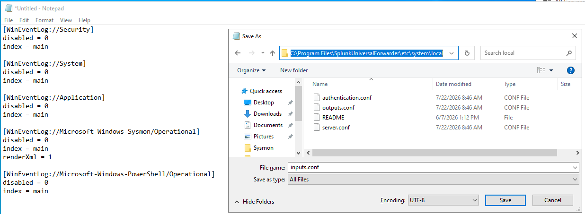

### PowerShell Script Block Logging via GPO

Script block logging (Event ID 4104) captures the decoded content of PowerShell commands as they execute — essential for detecting encoded reverse shells and obfuscated payloads. Enable it domain-wide through Group Policy.

On DC01, open **Group Policy Management** and create a new GPO linked to `lab.local`. Edit it and navigate to:

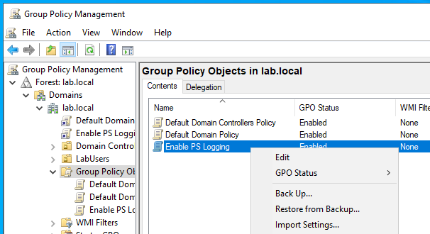

**Computer Configuration → Policies → Administrative Templates → Windows Components → Windows PowerShell → Turn on PowerShell Script Block Logging → Enabled**

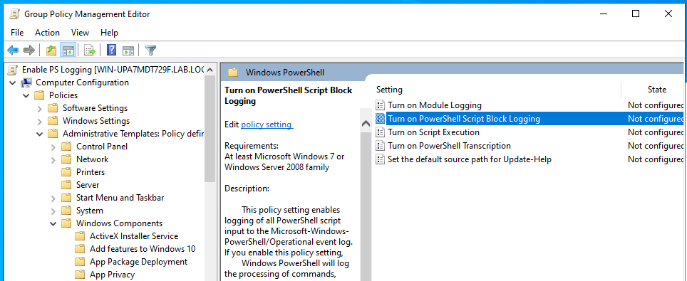

Apply immediately on both machines:

```
gpupdate /force
```

---

## 10. Verifying Data Flow

With everything configured, confirm logs are flowing into Splunk from all hosts. Run in the Splunk web UI (`http://10.10.10.5:8000`):

```
index=* | stats count by host, sourcetype
```

All hosts should appear with the expected sourcetypes — `WinEventLog` and `XmlWinEventLog:Microsoft-Windows-Sysmon/Operational` from DC01 and CLIENT02, `access_combined` from juiceshop, `syslog` and journal entries from kali.

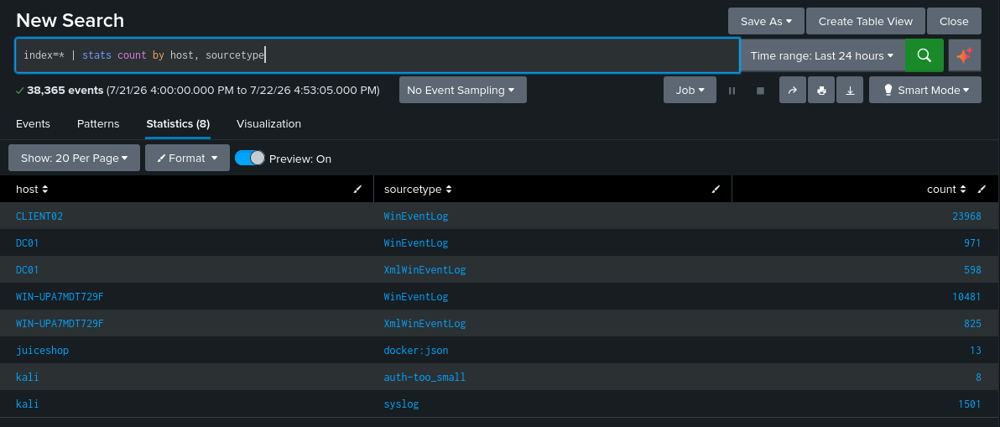

The lab is built, instrumented, and ready. The attack and detection exercise is in Part 2: [<u>Purple Team SOC Lab — Attack & Detect</u>](/socdocs/purple-team-lab-detections/).

---

## Summary

| Component | OS | IP | Key Config |
|---|---|---|---|
| pfSense | pfSense CE | 10.10.10.1 | WAN on VMNet8/NAT, LAN on VMNet2, DHCP for entire lab subnet |
| DC01 | Windows Server 2022 | 10.10.10.10 | lab.local domain controller, AD DNS, seeded misconfigurations |
| CLIENT02 | Windows 11 Pro | DHCP | Joined lab.local, Sysmon + Universal Forwarder |
| SPLUNK | Ubuntu Server 22.04 | 10.10.10.5 | Splunk Enterprise, receiving port 9997, Windows + Sysmon TAs |
| KALI | Kali Linux | DHCP | journald forwarding to Splunk |
| JUICESHOP | Ubuntu Server 22.04 | 10.10.10.50 | Docker + OWASP Juice Shop (NODE_ENV=unsafe), nginx body logging |

**Boot order:** pfSense first (DHCP and gateway must be up), DC01 second (DNS for the rest of the network), then everything else.
