## 1. Reconnaissance

An `autorecon` scan was run against the target, identifying two open services:

- **SSH**
- **HTTP**

### 1.1 Web Server
Browsing to the web service revealed a landing page.

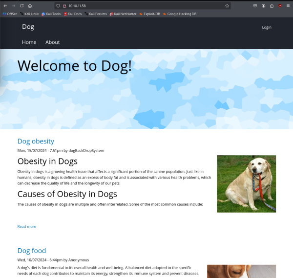

A domain name associated with the target was also identified.

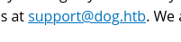

The site was identified as being powered by **Backdrop CMS**.

---

## 2. Initial Enumeration — Backdrop CMS

### 2.1 Version Assumption
A known RCE vulnerability exists for Backdrop CMS version **1.27.1**. The exact running version was not confirmed — it was assumed based on a hunch rather than direct verification.

### 2.2 Blocked by robots.txt
The identified RCE technique requires access to the `/admin/modules/install` path. However, the broader `/admin` path was disallowed via `robots.txt`.

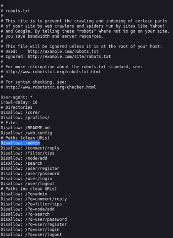

This blocked direct exploitation at this stage, requiring an alternate route to authenticated access.

### 2.3 Directory Bruteforcing — feroxbuster
`feroxbuster` was run against the site and surfaced two paths of interest:

- **`/core`** — exposed a number of interesting files/directories.

  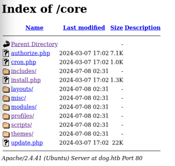

- **`/.git`** — an exposed Git repository.
    - Using the [<u>git-dumper tool</u>](https://github.com/arthaud/git-dumper) we can clone the repository.

  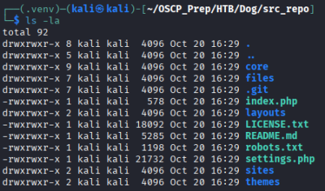

---

## 3. Credential & Secret Discovery via Git Exposure

Dumping the exposed `.git` repository yielded:

- A set of **credentials**.

  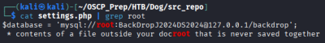

- A **password hash salt** (not needed).

  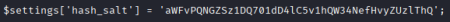

### 3.1 Database / User Enumeration
An attempt was made to enumerate the application's database (recovered via the git dump) in order to extract user accounts and password hashes for use against the login page. The local database didn't give us anything. 

We can use the [<u>BackDropScan tool</u>](https://github.com/FisMatHack/BackDropScan) to scan the list of users on the site using this command.

```
python BackDropScan.py --url http://dog.htb --userslist /usr/share/seclists/Usernames/Names/names.txt --userenum
```

This spray succeeded against the user **`tiffany`**.

---

## 4. Authenticated Access — Admin Panel

The `tiffany` account had **admin** privileges, granting access to the module upload functionality within Backdrop CMS — the functionality originally blocked by `robots.txt`/`/admin` restrictions.

### 4.1 CSRF-to-RCE Module
With admin access, a known exploit module was uploaded:

- Module source: [<u>CSRF-to-RCE-on-Backdrop-CMS (V1n1v131r4)</u>](https://github.com/V1n1v131r4/CSRF-to-RCE-on-Backdrop-CMS/releases/tag/backdrop)

Uploading this module exposed an endpoint capable of accepting and executing arbitrary commands.

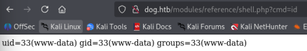

### 4.2 Reverse Shell
A reverse shell payload was sent to the exposed command endpoint via `curl`.

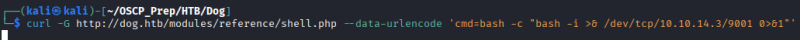

The payload executed successfully, returning a shell on the target.

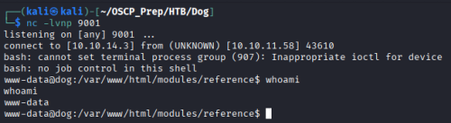

---

## 5. Privilege Escalation

### 5.1 User Enumeration on the Box
From the reverse shell, a list of local user accounts was obtained.

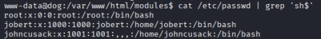

### 5.2 Credential Reuse — login as john
Using credentials recovered earlier from the `settings.php` file (via the git dump), a login was obtained for the local user **`john`**.

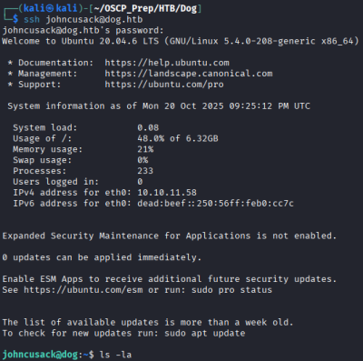

### 5.3 Sudo Misconfiguration — `bee`
Enumeration of `john`'s sudo privileges revealed permission to run the **`bee`** command (Backdrop CMS's CLI tool) as root.

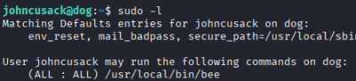

`bee` includes an **`eval`** option capable of executing arbitrary code, which — combined with root-level sudo access — provided a direct path to privilege escalation.

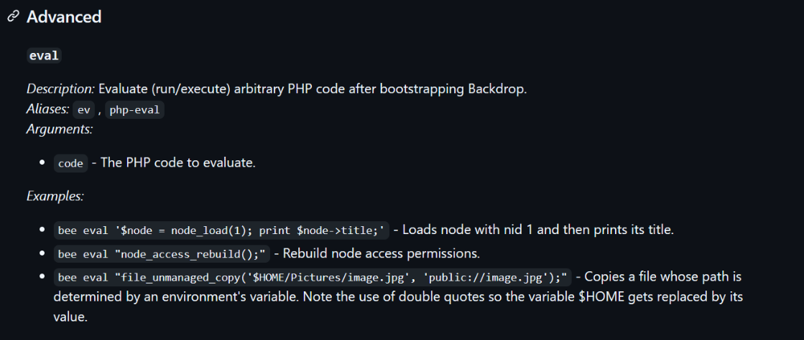

### 5.4 Root
By running the `eval` option from `/var/ww/html`, arbitrary code execution as root was achieved, completing the box.

```
sudo bee eval 'system("/bin/bash");
```

---

## 6. Summary

| Stage | Technique |
|---|---|
| Recon | Autorecon (SSH, HTTP); identified Backdrop CMS site + domain |
| Initial Blocker | `/admin` path disallowed by `robots.txt`, blocking direct RCE module install |
| Enumeration | `feroxbuster` discovered `/core` and exposed `/.git` repository |
| Credential Discovery | Git dump revealed credentials + password hash salt (`settings.php`) |
| Authentication | Username enumeration + password spray → admin login as `tiffany` |
| Exploitation | CSRF-to-RCE Backdrop module upload → command execution endpoint → reverse shell via curl |
| Lateral Movement | Local user enumeration → credential reuse (from `settings.php`) → login as `john` |
| Privilege Escalation | Sudo misconfiguration on `bee` CLI tool → `eval` option → arbitrary code execution as root |

### Key Takeaways
- Relying on `robots.txt` to restrict access to sensitive admin paths is not a real access control — it does not prevent direct requests to disallowed paths.
- Exposed `.git` directories are a critical information disclosure risk, frequently leaking credentials, secrets, and configuration files (here, via `settings.php`).
- Password reuse across web application accounts and local system accounts (`john`) significantly increased the impact of the initial credential leak.
- CLI utilities bundled with CMS platforms (like `bee`) can introduce dangerous privilege escalation paths when granted broad `sudo` rights, especially when they expose code-evaluation features.
