## 1. Reconnaissance

### 1.1 Nmap

An Nmap scan identified SSH, a web server on port 80, and a second HTTP service on port 8080 — both running Apache Tomcat.

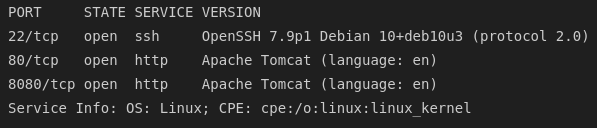

### 1.2 Web Application Enumeration

Port 80 served a landing page for a credit monitoring service called "Stratosphere." The only functional link led to a static "under construction" page.


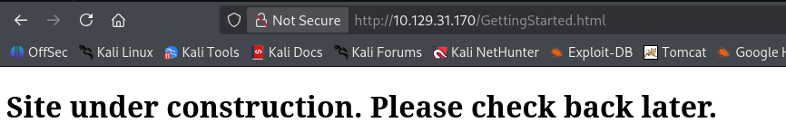

Triggering a 404 confirmed the server was running `Tomcat 8.5.54`. Port 8080 served the same content — likely just a proxy to the same backend.

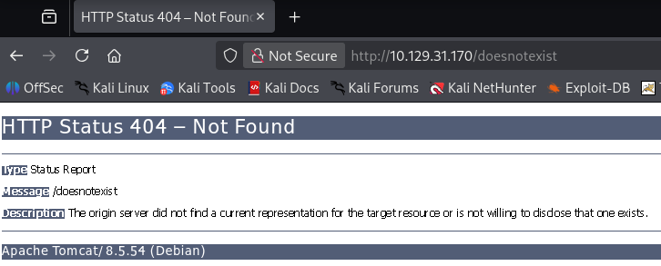

### 1.3 Directory Brute-Forcing

A gobuster scan surfaced two interesting paths: `/manager` (the standard Tomcat manager endpoint, which prompted for authentication) and `/Monitoring`.

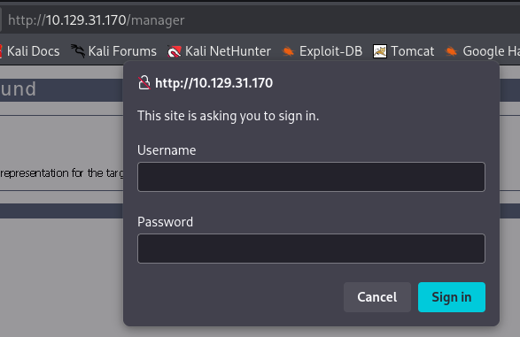

### 1.4 Identifying Apache Struts

Navigating to `/Monitoring` presented a sign-in/register page. Both the registration and login forms led to "under construction" placeholders — not much functionality to test. However, every URL in this section ended with the `.action` extension (`Welcome.action`, `Login_input.action`, `Register.action`, `Menu.action`), which is the signature URL pattern of the Apache Struts framework.

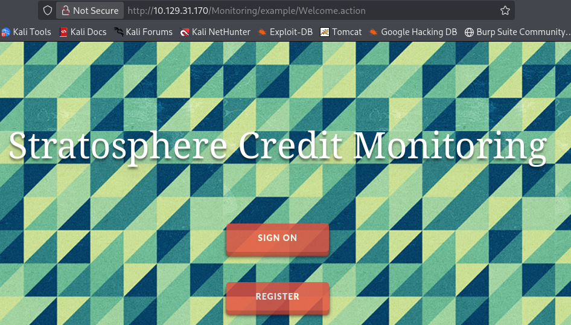
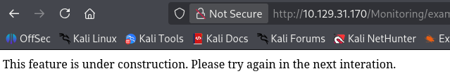

---

## 2. Initial Foothold — Apache Struts RCE

### 2.1 Exploiting the Struts Endpoint

Apache Struts has a long history of critical RCE vulnerabilities. The [struts-pwn](https://github.com/mazen160/struts-pwn) exploit was tested against the `/Monitoring/example/Welcome.action` endpoint, and confirmed code execution as the `tomcat8` service account.

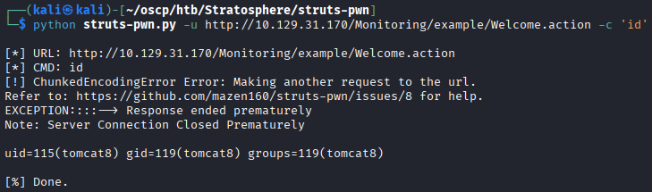

### 2.2 Working Within a Restricted Shell

The `tomcat8` user turned out to be heavily restricted — no outbound pings, no `wget`, no `curl`, no `netcat`. No reverse shell was possible. However, the code execution primitive was still useful for enumerating the local filesystem.

Browsing Tomcat's configuration files revealed `/var/lib/tomcat8/db_connect`, which contained MySQL credentials. These didn't work for SSH, but they were valid for running local `mysql` commands through the Struts RCE:

```bash
python struts-pwn.py -u http://10.129.31.170/Monitoring/example/Welcome.action \
  -c 'mysql -u admin -padmin -e "use users; select * from accounts"'
```

This dumped the `accounts` table from the `users` database, revealing a credential for **richard**.

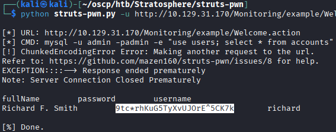

---

## 3. Initial Shell

The recovered credential worked for SSH, providing a proper interactive shell as **richard**.

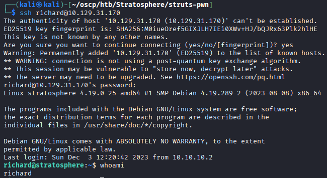

---

## 4. Privilege Escalation

### 4.1 sudo Permissions

Running `sudo -l` revealed that **richard** could execute `/home/richard/test.py` as root using any Python version (the sudo rule specified `/usr/bin/python*`).

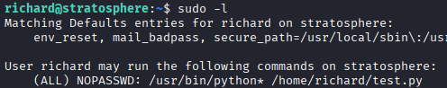

### 4.2 Reviewing the Script

The script was a hash-cracking quiz — it presented four hashes (MD5, SHA1, MD4, and BLAKE2b512) and asked the user to provide the corresponding plaintext for each. All four were crackable with `john` against `rockyou.txt`.

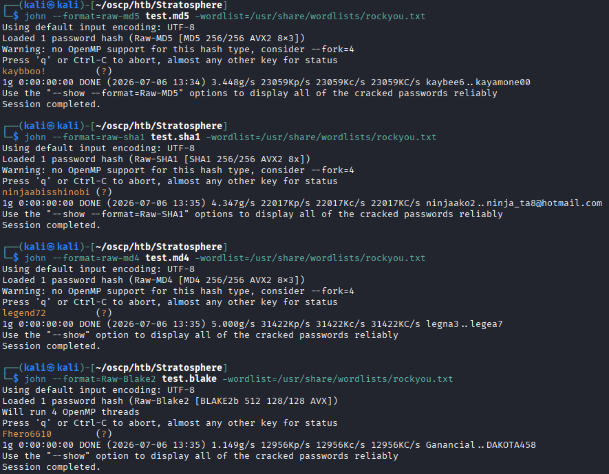

Solving all four hashes worked, but the script simply tried to call `/root/success.py`, which didn't exist — so completing the quiz the "intended" way was a dead end.

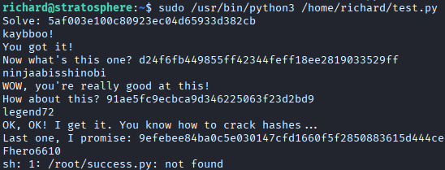

### 4.3 Python Library Hijacking

The real vulnerability wasn't in solving the quiz — it was in the script's first line after the shebang: `import hashlib`. Python resolves imports by searching the current working directory before system paths. Since the script lived in richard's home directory and the sudo rule ran it from there, placing a malicious `hashlib.py` in the same directory would cause it to be loaded instead of the real `hashlib` module — with root privileges.

A simple `hashlib.py` was created to spawn a root shell:

```python
import pty
pty.spawn("/bin/bash")
```

Running the script with `sudo` loaded the hijacked module and dropped straight into a root shell.

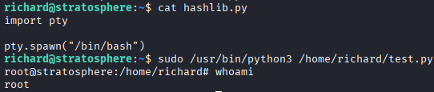

---

## 5. Summary

| Stage | Technique |
|---|---|
| Recon | Nmap identified Tomcat on ports 80/8080 and SSH |
| Enumeration | Gobuster found `/Monitoring`; `.action` URL extensions identified Apache Struts |
| Initial Access | Apache Struts RCE via `struts-pwn` → restricted command execution as `tomcat8` |
| Credential Recovery | MySQL credentials in `/var/lib/tomcat8/db_connect` → database dump via Struts RCE → SSH credential for **richard** |
| Privilege Escalation | `sudo` rule allowed running a Python script as root; Python library hijacking (`hashlib.py` in CWD) gave a root shell |

### Key Takeaways
- Apache Struts remains one of the most reliably exploitable Java web frameworks — the `.action` URL pattern is an immediate red flag worth testing even when the application itself appears non-functional.
- A restricted shell doesn't mean a useless shell. Even without outbound connectivity, local filesystem enumeration and database access through an RCE primitive can yield credentials that unlock better access elsewhere (in this case, SSH).
- Python's import resolution order — checking the current directory before system libraries — is a well-known privilege escalation vector. Any `sudo` rule that runs a Python script from a user-writable directory is effectively granting root, regardless of what the script itself does.
- Credentials stored in plaintext configuration files (like `db_connect`) are a recurring theme. The chain here was config file → database → password reuse for SSH — a pattern that shows up constantly in real environments.